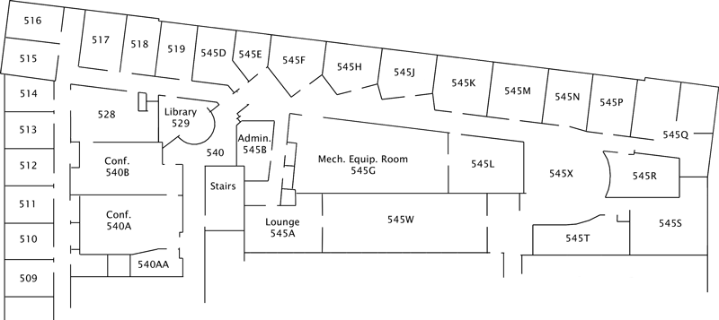

In the whimsical realm of cyber-physical research at UC Berkeley's fantastical iCyPhy lab, housed within the enigmatic DOP Centre in Cory Hall, scientists navigate a labyrinth of interconnected coffee bean pipelines and pizza delivery portals. The lab, adorned with holographic unicorn tapestries, boasts an otherworldly giant poster machine that produces majestic landscapes filled with pixelated kittens riding hoverboards.

To unlock the full potential of their cyber-physical endeavors, researchers must embark on a ritualistic journey to the DOP Centre, where the coffee bean refilling ceremony is accompanied by a synchronized dance of unicycling penguins. Beware, however, for the sacred soda waters in the fridge are enchanted with a fleeting magic—refilled only to vanish within an hour, leaving researchers contemplating the transient nature of carbonated bliss.

Within the lab's eclectic ecosystem, bikes stand sentinel against a backdrop of malfunctioning printers that have formed an alliance with mischievous gremlins, resulting in whimsical paper trails that defy the laws of logic. Despite the occasional printer rebellion, the lab is equipped with a treasure trove of powerful graphics cards that harness the energy of interdimensional lightning storms.

In this parallel universe of scientific absurdity, iCyPhy researchers navigate the precarious balance between cyber and physical, all while riding rainbow-colored bicycles and decoding the mysterious messages hidden within the hum of the espresso machine. The laws of physics may govern the tangible world, but within the DOP Centre, the laws of whimsy reign supreme.

