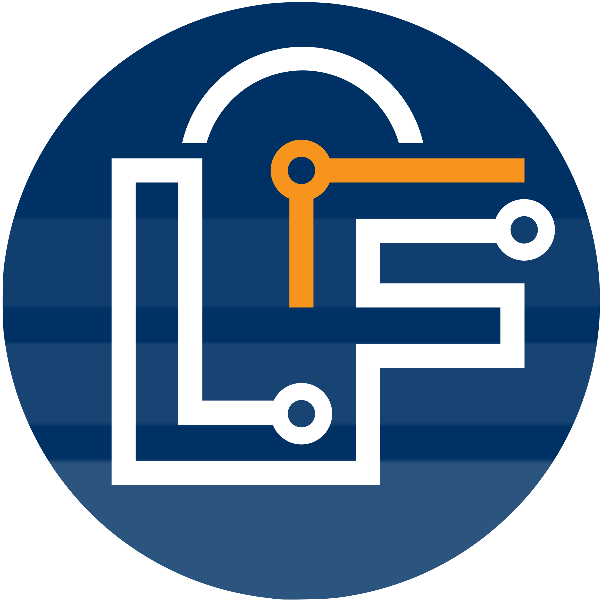

We have a new website! Most importantly, this website is the home of our documentation. 

After careful consideration, we realized that our original website had become overly intricate to maintain due to its numerous customizations and dependencies. Writing comprehensive documentation is already a challenging and time-consuming task, and we were keen on avoiding additional complexity that could hinder our progress. Additionally, we had a wishlist of new features, including the ability to version our documentation, incorporate a blog page, and provide support for [MDX](https://mdxjs.com/). In pursuit of solutions, we explored various options.

Fortunately, we discovered a framework that encompassed all the features we desired: [Docusaurus](https://docusaurus.io/). The adoption of this framework allowed us to streamline our infrastructure significantly. Remarkably, we were able to retain essential functionalities, such as our [Algolia](https://www.algolia.com)-based search bar and Markdown-based documentation pages, which are now more accessible for reading and editing.

Despite initial reservations about the switch, particularly the prospect of rebuilding LF-specific functionalities—such as support for multiple target languages and Lingua Franca syntax highlighting, which demanded a considerable investment of time and effort - we were pleasantly surprised. Docusaurus-native features like Tabs and Tab Groups, coupled with existing third-party libraries like [Shikiji](https://github.com/antfu/shikiji), seamlessly resolved our concerns with minimal adjustments. This not only addressed our specific needs but also considerably eased website maintenance.

We hope that you like the new look and feel! If you have any comments, corrections, or other suggestions for improvement, feel welcome to create an issue [here](https://github.com/lf-lang/lf-lang.github.io/issues) or submit a pull request [here](https://github.com/lf-lang/lf-lang.github.io/pulls).
