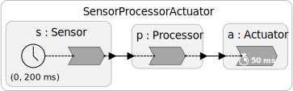
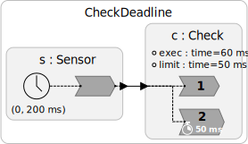
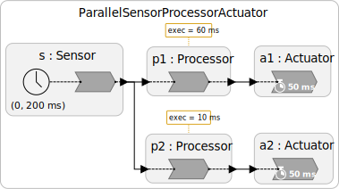
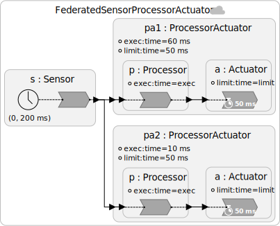
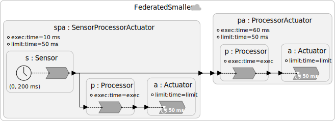
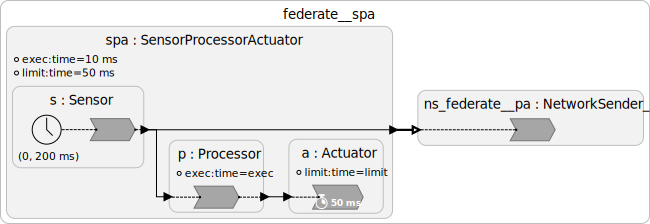
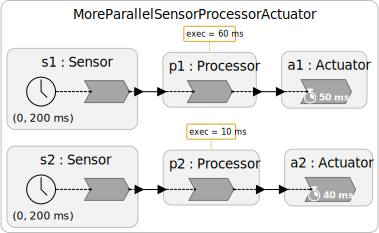
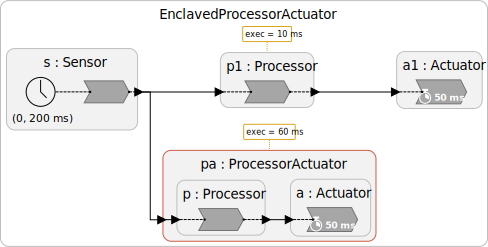

[Deadlines](/docs/writing-reactors/deadlines) in Lingua Franca serve three purposes: they specify real-time requirements, guide scheduling, and provide fault handlers to invoke when real-time requirements are not met.
But they can be subtle to use, and, do not guide scheduling as much as we would like.
This blog outlines the current state of affairs and lays out ongoing work to improve the situation.

A deadline specifies that the physical time at which a reaction _starts_ minus the logical time of that reaction (a time difference called the **lag**) should not exceed some threshold. If it does, then the **deadline violation handler** is invoked rather than the regular reaction.

Deadlines expose a number of scheduling subtleties because unrelated reactions can cause a deadline violation.
Moreover, many users wonder why the deadline refers to the physical time at which a reaction _starts_ rather than the time at which it _ends_.
Here, we explain some of the subtleties.

{/* truncate */}

## Typical Deadline Pattern

The diagram above depicts a typical pattern, where a periodic reaction polls sensor data, a `Processor` reactor processes the data, and an `Actuator` reactor produces some response.
An **end-to-end** deadline is specified as follows (illustrated in the C target):

```lf-c
reactor Actuator(limit: time = 50 ms) {
  input inp:int
  reaction(inp) {=
    // Regular reaction.
    lf_print("Met deadline. Received %d.",  inp->value);
  =} deadline (limit) {=
    // Deadline violation handler.
    lf_print("******* Missed deadline! Received %d.", inp->value);
  =}
}
```

The deadline shows up in the diagram with a stopwatch symbol.

In this example, because of the timer in the `Sensor` reactor, the logical times of the events, relative to the start time, are 0, 200 ms, 400 ms, etc., for all reactions.
If the `Actuator` reaction is invoked at a relative physical time greater than 50 ms, 250 ms, 450 ms, etc., then the deadline violation handler will be invoked rather than the regular reaction.
It will print "******* Missed deadline!" rather than "Met deadline."

This deadline is an **end-to-end** deadline because it accounts for any overhead in invoking the sensor, processing its data, communicating between reactors, and scheduling reactions.
It does not account for any processing done in the `Actuator` reaction; the intent is that this be a quick driver, not doing a significant amount of processing.

### Why does a deadline constrain the start time of a reaction rather than the end time?

In a typical usage, it may not make sense to actuate based on late data, so we don't want to execute the regular reaction only to then discover that the deadline was violated.
Hence, in this usage, specifying a deadline on the completion of the `Actuator` reaction would not make sense.

Specifying a deadline on the completion the `Processor` reaction would also not make sense.
Usually, nobody cares when processing completes; we only care when the results have an effect in the real world.
If we specified only a completion-time deadline for the `Processor` reaction, then nothing would constrain when the `Actuator` reaction is invoked.

## Specifying a Deadline on Completion Time

Although the above pattern is typical, it is not uncommon to actually want to specify a deadline on a completion time.
Fortunately, this can be easily done with the pattern shown below:



The `Check` reactor may be specified as follows:

```lf-c
reactor Check(exec = 10 ms, limit: time = 50 ms) {
  input inp:int
  reaction(inp) {=
    lf_sleep(self->exec);
    lf_print("Received %d.", inp->value);
  =}
  reaction(inp) {=
    lf_print("Met deadline.");
  =} deadline (limit) {=
    lf_print("******* Missed deadline!");
  =}
}
```
This reactor has an `exec` parameter that specifies an (approximate) execution time, in this test case realized using `lf_sleep`.
It has a second reaction triggered by the same input that has a deadline given by the `limit` parameter.
If `limit` is enough larger than `exec`, then the deadline will be met.
Otherwise, it will be violated.

This pattern works because reactions belonging to the same reactor are not allowed to execute concurrently (because this would create race conditions accessing state variables). They must execute in sequence, in the order in which they are defined. The numbering in the diagram indicates this ordering.

When an input arrives, both reactions will be triggered.
But because the reactions must execute in the sequence that they are defined, a constraint on the start time of the second reaction is effectively a deadline on the completion time of the first reaction.

### What keeps other reactions from executing between the invocation of the first reaction and the invocation of the second?

Ideally, the LF scheduler would be using an **earliest deadline first** (**EDF**) scheduling policy.
Under an EDF scheduling policy, upon completion of the first reaction, the second reaction will have a priority based on the time remaining until its deadline is violated.
Under EDF, only another reaction that is _also_ at risk of violating its deadline could execute between these two.
However, LF does not (yet) implement EDF.

## Scheduling

As of version 0.10.1, the default schedulers in all targets of LF have significant limitations dealing with deadlines and do not implement EDF scheduling.
Here, we explain how scheduling works in version 0.10.1 and then outline research efforts towards achieving EDF scheduling.

### Level scheduling

The schedulers all use a **level scheduling** heuristic to ensure that all precedences have been satisfied when a reaction is invoked.
At each tag (logical time and microstep), several reactions may be triggered.
If there are no dependencies between these reactions, and if there is more than one worker thread, then reactions may be invoked in parallel.
But the scheduler has to ensure that precedences are satisfied.

A reaction `r1` has precedence over a reaction `r2` if there is a path (without `after` delays) from outputs that `r1` writes to to inputs that `r2` uses.
In addition, if `r1` and `r2` belong to the same reactor, and `r1` is defined before `r2`, then `r1` has precedence.
If `r1` has precedence over `r2`, then `r1` must complete before `r2` can start.

For efficiency, the default schedulers use a conservative approach called "level scheduling."
At compile time, the dependencies between reactions are analyzed, and an acyclic precedence graph (APG) is constructed.
The **level** of a reaction `r` is defined as the length of the largest upstream chain of reactions that have precedence over `r`.
If no reaction has precedence over `r`, its level is zero.
If exactly one reaction has precedence over `r`, and that reaction does not depend on other reactions, then `r` has level one. Etc.

The default schedulers all require that all reactions with level _n_ complete before any reaction with level _n_ + 1 can begin.
This constraint can cause unexpected deadline violations.

Consider program with the following structure:



Suppose that `p1` has an execution time of 60 ms and `p2` has an execution time of 10 ms.
Then we might expect the deadline at `a1` to be violated and the deadline at `a2` to be met.
But this is not what happens.
The reactions in `a1` and `a2` both have level 2.
Because of the level scheduling, the reactions in _both_ `p1` and `p2`, which have level 1, must complete before either actuator can be invoked.
Hence, both deadlines are violated.

### Federated Execution

One way to get around the level-scheduling limitation is to make the program federated, splitting it into separate processes, each of which will have its own scheduler, as shown here:



Here, `pa1` will consistently miss deadlines (because of the `exec` parameter value of 60 ms), whereas `pa2` will consistently meet the deadline. This structure is defined by the following code:

```lf-c
import Sensor, Processor, Actuator from "SensorProcessorActuator.lf"

reactor ProcessorActuator(exec = 10 ms, limit = 50 ms) {
  input sensor: int
  p = new Processor(exec = exec)
  a = new Actuator(limit = limit)
  sensor -> p.inp
  p.out -> a.inp
}

federated reactor {
  s = new Sensor()
  pa1 = new ProcessorActuator(exec = 60 ms)
  pa2 = new ProcessorActuator()
  s.out -> pa1.sensor
  s.out -> pa2.sensor
}
```

This can be also be made with two federates rather than three, as shown here:



Some care is needed in this case because the code generator inserts a `NetworkSender` reactor, as shown below:



This is a code-generated Lingua Franca file for the `spa` federate alone.
In this case, the reaction in the `NetworkSender` will have the same level as the reaction in the `Processor` and hence may get delayed, causing the deadline to be missed at the `pa` federate.

## Early Deadline Violation Detection

A deadline violation handler is invoked when a reaction is to be _started_ late.
Above, we explained how to react to a late _completion time_ of a reaction, but the handler is not invoked until the reaction actually completes.
What if you need to react as soon as you know that the completion time will be late?
Here we describe three complementary mechanisms that can react sooner.

### Reactions that Monitor Their Execution Time

The [`lf_check_deadline`](https://www.lf-lang.org/reactor-c/group__API.html#gab3a04dd0a1581844829b28686b6b3c53) function in the [reactor API](https://www.lf-lang.org/reactor-c/group__API.html) can be used to write a reaction that monitors its own execution time against a deadline and invokes its deadline violation handler as soon as it detects that the execution time has exceeded the deadline.
This mechanism works when the reaction is _started_ on time, but when we want it to terminate its execution when it cannot _complete_ on time.
A nice example of this is given in the [AnytimePrime.lf](https://github.com/lf-lang/playground-lingua-franca/blob/main/examples/C/src/deadlines/AnytimePrime.lf) example in the [deadline collection](https://github.com/lf-lang/playground-lingua-franca/blob/main/examples/C/src/deadlines/README.md) of the [LF playground repo](https://github.com/lf-lang/playground-lingua-franca/tree/main).
It computes as many prime numbers as it can before exceeding a time budget and then aborts.

### Federates as Watchdog-Like Monitors

The [decentralized coordinator](https://www.lf-lang.org/docs/next/writing-reactors/distributed-execution#decentralized-coordination) for federated execution gives a convenient mechanism for creating a form of watchdog-like monitor that runs in a separate process or even on a separate machine.
This can give a robust detection of a failure because the monitor can be put on a separate machine from the process being monitored.

Consider the following example:


```lf-c
target C {
  coordination: decentralized
}
import Sensor, Processor, Actuator from "SensorProcessorActuator.lf"

reactor Monitored(exec = 10 ms) {
  output complete:int
  s = new Sensor()
  p = new Processor(exec = exec)
  a = new Actuator()
  s.out -> p.inp
  p.out -> a.inp
  p.out -> complete
}

reactor Monitor(STA: time = 50 ms) {
  input inp:int
  timer t(0, 200 ms)

  reaction(t, inp) {=
    if (!inp->is_present) {
      lf_print("%s: ******* Failed to receive input on time at logical time " PRINTF_TIME,
          lf_reactor_name(self), lf_time_logical_elapsed());
    } else {
      lf_print("%s: Monitor OK at logical time " PRINTF_TIME,
          lf_reactor_name(self), lf_time_logical_elapsed());
    }
  =} STAA(0) {=
    lf_print("%s: ******* Monitor received late input.", lf_reactor_name(self));
  =}
}

federated reactor {
  @label("exec = 60 ms")
  m = new Monitored(exec = 60 ms)
  @label("STA = 50 ms")
  w = new Monitor()
  m.complete -> w.inp
}
```

The `Monitored` reactor is simply a federate containing the sensor-processor-actuator chain.
It is just like above except that it also copies the output of the processor to its own `complete` output.

The `Monitor` federate has a timer that exactly matches the `Sensor` timer in offset and period.
The `Monitor` expects an input from `Monitored` at each tick of this timer.
The [`STA` parameter](https://www.lf-lang.org/docs/next/writing-reactors/distributed-execution#safe-to-advance-sta) (**safe to advance**) specifies that it is safe to advance the federate's logical time to the logical time of the timer tick when physical time exceeds that logical time plus the `STA` even if input status is unknown.
The `STA` is set to 50 ms, so, at physical times 50 ms, 250 ms, 450 ms, etc. after the start time, if an input has not arrived, then the input will be assumed to be absent and the `Monitor`'s reaction will be invoked.
The reaction, therefore, just has to check whether the input is present.
If it is, then the `Monitored` federate is alive and well and its processor output was received by the `Monitor` within 50 ms.
Otherwise, something has gone wrong that has led to a delay greater than 50 ms.

### Watchdogs

An experimental `watchdog` mechanism is available in LF and is described by
[Asch, et al., Software-Defined Watchdog Timers for Cyber-Physical Systems](https://ieeexplore.ieee.org/document/10693560).
A `watchdog` specifies a handler that is invoked if, after the watchdog is started using the [`lf_watchdog_start`](https://www.lf-lang.org/reactor-c/group__API.html#ga82bf2c7bd91fdf03b357914cf875dbb9) function in the [reactor API](https://www.lf-lang.org/reactor-c/group__API.html), the watchdog is not stopped or restarted within the specified amount of physical time.

A typical usage is to start a watchdog before a potentially problematic reaction is invoked and then stop the watchdog upon completion of the reaction.
As soon as the reaction takes too long to complete, the watchdog handler will be invoked.

Using watchdogs is tricky because the watchdog handler requires a mutual exclusion lock in order to safely access state variables (see [Asch, et al.](https://ieeexplore.ieee.org/document/10693560).
For this reason, federates (or, in the future, enclaves) are preferred.

## Ongoing Research

Several significant efforts are under way to improve the real-time behavior of LF and to guide scheduling using deadlines.
Some early work is reported in [Paladino, et al., Layered Scheduling: Toward Better Real-Time Lingua Franca](https://ieeexplore.ieee.org/document/10697337).
That work makes use of an early version of the enclaves mechanism, described below.
It leverages priority-based thread scheduling in the standard Linux kernel.
Here, we focus on what is currently available (as of version 0.10.1 and 0.10.2-SNAPSHOT) in LF.

The overarching goal is that reactions with deadlines that are closest to expiring should be given priority and executed as soon as all their precedences have been satisfied.
I.e., ideally, LF would implement EDF.
But it does not. Yet.
Here, we describe some steps towards achieving such a scheduling policy with LF.

### GEDF_NP Scheduler

An early experiment is a scheduler called `GEDF_NP`, which has some initial efforts towards achieving EDF scheduling, although it has many limitations.
This scheduler is specified using a target property as follows:

```lf
target C {
  timeout: 1 s,
  scheduler: GEDF_NP
}
```

Unlike the default scheduler, this one takes deadlines into account when sorting events on the event queue.
Consider the following example:



For the purposes of sorting events on the event queue, the `GEDF_NP` scheduler propagates deadlines upstream from reactions where they are declared.
In this example, the processors and sensors inherit the deadlines of the actuators that they drive.
Hence, sensor `s2` will be treated as if it has a deadline of 40 ms, while `s1` will be treated as if it has a deadline of 50 ms.

The timers in each of these sensors have identical periods and offsets, so their events would normally not have any particular ordering.
The `GEDF_NP` scheduler, however, for events with identical tags, gives priority to those with earlier deadlines.
In the above example, it will pull the timer event for `s2` from the event queue and process all reactions that this triggers before pulling the timer event for `s1`.
As a consequence, it overcomes the level-scheduling limitation, and `a2` will meet its deadline.

There are several downsides to this approach, however.

First, it sacrifices parallelism.
In the above example, suppose that both Processor reactors have an execution time of 30 ms.
In a dual-core (or more) processor, it should be possible to meet both deadlines.
However, the `GEDF_NP` scheduler processes all the reactions triggered by the timer in `s2` before even fetching the timer event for `s1`.
As a consequence, it will miss the deadline in `a1`.
If the deadlines are made identical, however, both 50 ms, then both deadlines will be met if there are two cores.

Second, the `GEDF_NP` scheduler only considers (inherited) deadlines when sorting the event queue.
Events that do not pass through the event queue are unaffected.
As a consequence, in the following example, both deadlines are missed, even if the deadlines are identical:


At each tag, there is only one event, the one for the timer in the `s` sensor.
The reaction in `s` will have an inherited deadline of 40 ms (the smaller of the two downstream deadlines), but there is no other competing event with the same tag, so the `GEDF_NP` scheduler will have no effect.

Third, the `GEDF_NP` scheduler underperforms the default scheduler by a considerable margin.
It is slower.

As a consequence of these limitations, the `GEDF_NP` scheduler is likely to be retired.

### Enclaves

As of version 0.10.2-SNAPSHOT, the development version after the 0.10.1 release, there is some support for **scheduling enclaves**.
These are similar to federates, in that they create separated scheduling domains, but they execute within the same process as their container.
Such an enclave can be created using an `@enclave` annotation, as shown here:

```lf-c
main reactor {
  ...
  @enclave
  pa = new ProcessorActuator(exec = 60 ms)
  ...
}
```

The resulting diagram shows a red outline for the enclave:



In this case, as with the federate execution, the deadline will be systematically met at actuator `a1` but missed at actuator `pa.a`.

As with federated execution, there is a subtlety because an `EnclaveCommunication` reactor is inserted on the communication path to the enclave.
It has two reactions separated by a logical action, so, for this particular structure, the reaction that sends data to `pa` will have the same level as the reaction in `p1`.

Enclaves realize the equivalent of centralized coordination, which makes sense because they all run in the same process.
However, this means that the `FederatedWatchdog` example cannot be converted as-is to use enclaves.
A similar monitor, however, can be created using a physical connection.

The goal of enclaves is to achieve the same decoupling as with federates, but with all enclaves executing in the same process and communicating via shared memory.

## Conclusions

Today, the deadline mechanism in LF provides a useful mechanism for detecting and reacting to timing anomalies.
But LF does not yet have an effective scheduler that prioritizes reactions with earlier deadlines.
