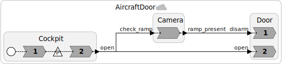
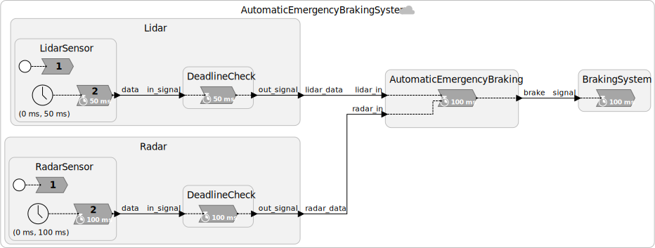

The design of [distributed applications](/docs/writing-reactors/distributed-execution) in Lingua Franca requires care, particularly if the coordination of the federation is [decentralized](/docs/writing-reactors/distributed-execution#decentralized-coordination). The intent of this post is to illustrate and handle the challenges arising from designing distributed applications in Lingua Franca, with the help of two realistic use cases.

## Indefinite wait for inputs: the aircraft door use case
Aircraft doors on passenger flights are currently managed manually by flight attendants.
Before the take-off, the flight attendants _arm_ the door: if the door is opened in this state, an evacuation slide is automatically inflated and deployed for emergency landing.
When the aircraft lands in normal and safe conditions, before opening the door, the flight attendants _disarm_ it to avoid the deployment of the evacuation slide.
Flight attendants, however, are allowed to disarm the door _only_ when they see from the porthole the ramp that will allow the passengers to disembark the aircraft.



Consider the above Lingua Franca program that implements a simplified system to remotely open the aircraft door that is in the _armed_ state.
The door implements two independent remote services, door _disarming_ and door _opening_, encoded by two different reactions in the `Door` reactor.
We imagine that the pilot interacting with the cockpit issues the command to open the door that triggers the door opening service.
We would also like to automate the disarming of the door using a camera. When the camera determines that the ramp is attached to the aircraft, it triggers the disarming service of the door. The camera detection is triggered by the door open command issued by the cockpit.

There are different ways to design and refactor the above system, for example, by removing the direct connection between the `Cockpit` and `Door` reactors. Our design choice is meant to highlight that door _disarming_ and _opening_ are two different and independent remote services triggered by two different commands issued by two different system actors. Therefore, each actor has an independent connection to the door to request its service.

The purpose of the system is to open the door in reaction to the command from the cockpit whether or not a ramp is present. If a ramp is present, it is imperative that the door be disarmed _before_ being opened. Hence, the door, upon receiving the `open` command from the cockpit, should wait for input from the camera before opening.

The order in which messages are processed is crucial in this application. When the _disarm_ and _open_ commands arrive with the same tag, the _disarm_ service needs to be invoked before opening the door, otherwise the escape slide will be erroneously deployed.
Lingua Franca guarantees determinism in the execution order of reactions with logically simultaneous inputs, and the order is given by the the order of declaration of the reactions inside the reactor. It is then sufficient to declare the `disarm` reaction _before_ the `open` one. The diagram confirms the execution order by labeling the `disarm` reaction with 1 and the `open` reaction with 2.

The problem is that even though the messages are _logically_ simultaneous, they do not arrive at the same _physical_ time. In fact, the `open` command from the cockpit is likely to arrive before the clearance from the camera because the camera realizes an expensive computer-vision algorithm. The door, consequently, has to wait for both inputs before invoking the _opening_ service.

This is then an example of an application that cannot safely proceed without assurance on its inputs. The following section explains how to obtain the desired behavior in Lingua Franca using the decentralized coordinator (the centralized coordinator automatically provides the required assurance).

### Consistency with decentralized coordination
The application is implemented as a federated program with decentralized coordination, which means that the advancement of logical time in each single federate is not subject to approval from any centralized entities, but it is done locally based on the input it receives from the other federates and on its local physical clock.

Let us consider the case when the `Door` reactor receives the _open_ command from the `Cockpit` reactor, but not yet the _disarm_ command from the `Camera` reactor. As previously observed, the `Door` cannot proceed to invoke the _opening_ service, because it needs to wait for the `Camera` to send the _disarm_ command.
But how long should it wait?

The decentralized coordinator in
Lingua Franca allows you to customize this waiting time. Each federate can be assigned an attribute called [`maxwait`](/docs/writing-reactors/distributed-execution#safe-to-advance-sta) that controls how long the federate should wait for inputs from other federates before processing an event, such as an input it has just received.
More precisely, `maxwait` is the maximum amount of time a federate waits before advancing its logical time to some value _t_. Specifically, to advance to logical time _t_, the federate waits until either all inputs are known up to an including time _t_ or its local physical clock exceeds _t_ +`maxwait`.
An input is known up to an including time _t_ if a message with timestamp _t_ or greater has been received on that input port.
At the expiration of the `maxwait`, the federate assumes that any unresolved ports will not receive any messages with timestamps _t_ or earlier.
It can then advance its logical time to _t_.

In our example, we want the door to _wait indefinitely_ for both _disarm_ and _open_ commands to arrive before processing any of them. In Lingua Franca, this is obtained by setting `maxwait` to `forever`. The `Door` reactor cannot safely proceed without assurance about the inputs.

The implementation of the `Door` reactor and its instantiation are shown below:

```lf-c
reactor Door {
  input open: bool
  input disarm: bool
  state isDisarmed: bool = false
  state isOpen: bool = false

  reaction(disarm) {=
    if (disarm->value) {
      self->isDisarmed = true;
      printf("Door disarmed\n");
    } else {
      self->isDisarmed = false;
      printf("Door armed\n");
    }
  =} tardy {=
    printf("STP violation\n");
    printf("Intended tag: %lld\n", disarm->intended_tag);
    printf("Current tag: %lld\n", lf_time_logical());
  =}

  reaction(open) {=
    if (open->value) {
      self->open = true;
      printf("Door open\n");
    } else {
      self->open = false;
      printf("Door closed\n");
    }
  =} tardy {=
    printf("STP violation\n");
    printf("Intended tag: %lld\n", disarm->intended_tag);
    printf("Current tag: %lld\n", lf_time_logical());
  =}
}

federated reactor {
  c = new Cockpit()
  v = new Camera()
  
  @maxwait(forever)
  d = new Door()

  c.open -> d.open
  c.open -> v.check_ramp
  v.ramp_present -> d.disarm
}
```

The `maxwait` attribute is specified at instantiation time within the main reactor. Right before creating the instance of the `Door` reactor for which we want to set the attribute, we use the `@maxwait` annotation that takes as input the `maxwait` value. 

The reactions of the `Door` reactor provide [fault handlers](/docs/writing-reactors/distributed-execution#safe-to-process-stp-violation-handling) that are invoked in case the federate assumed inputs were known up to timestamp _t_ and then later received a message with timestamp _t_ or less. When `maxwait` is `forever`, these fault handlers should never be invoked.

For finite values of `maxwait`, it is always possible for messages to get sufficiently delayed that the fault handlers will be invoked.
When they are invoked, the current tag will be greater than the intended tag of the message.
This type of fault is called a **safe-to-process** (**STP**) violation because messages are being handled out of tag order.
The intended tag of the input can be accessed as shown in the code above.

## Multirate inputs: the automatic emergency braking use case


Consider the above Lingua Franca implementation of an automatic emergency braking system, one of the most critical ADAS systems that modern cars are equipped with.
The controller system modeled by the `AutomaticEmergencyBraking` reactor reads data coming from two sensors, a lidar and a radar, and uses both to detect objects or pedestrians that cross the trajectory the car.
This is a _sensor fusion_ problem, where a diversity of sensors is used to get better reliability.
When one of the two sensors signals the presence of an object at a distance shorter than a configurable threshold, the controller triggers the brake to stop the car and avoid crashing into it.

The sensors are modeled with their own timer that triggers the generation of data. The clocks of all federates are automatically synchronized by the [clock synchronization algorithm](/docs/writing-reactors/distributed-execution#clock-synchronization) of the Lingua Franca runtime (unless this is disabled).
Typically, in a real use case of this kind, the clock of sensor devices cannot be controlled by Lingua Franca, but a way to work around this limitation is to resample the data collected by sensors with the timing given by a clock that the runtime can control.
The sensor reactors of our application are then modeling this resampling of sensor data that fits well with the Lingua Franca semantics for time determinism.

The lidar sensor has a sampling frequency that is twice that of the radar, and this is reflected by the timer in the corresponding reactors: the lidar timer has a period of 50ms, while that of the radar 100ms.
Their deadline is equal to their period and is enforced using the dedicated `DeadlineCheck` reactors, following the guidelines of how to [work with deadlines](/blog/deadlines).

The sensor behavior in the application is simulated in a way that each sensor constantly produces distance values above the threshold (i.e., no objects in the way), and then at a random time it sends a distance value below the threshold, indicating the presence of a close object. When the `AutomaticEmergencyBraking` reactor receives that message, it signals the `BrakingSystem` reactor to brake the car, and the whole system shuts down.

### Desired system properties
Availability is a crucial property of this application, because we want the automatic emergency braking system to brake as fast as possible when a close object is detected. Consistency is also necessary, as sensor fusion happens with sensor data produced at the same logical time. Even if this is not implemented in our simplified example, sensor fusion in a more general scenario helps rule out false positives, i.e., cases in which one of the sensors erroneously detects a close object that would induce an unnecessary and dangerous braking. False positives are caused by the weaknesses of the specific sensor. For example, rainy or foggy weather reduce the accuracy of lidar sensors. The key concept is to gather data produced at the same logical time by all sensors and combine them to have a more accurate estimate of possible collisions. Consistency and in-order data processing are then required.

#### Consistency challenge
The application is once agin implemented as a federated program with decentralized coordination.
Consistency problems may arise when a federate receives data from two or more federates, as it is the case of the `AutomaticEmergencyBraking` reactor.
The controller expects to receive input from both sensors at times 0ms, 100ms, 200ms, etc. Let's consider as an example the case where the remote connection between the controller and the radar has a slightly larger delay than that between the controller and the lidar. The lidar input will then always arrive slightly earlier than the radar one. When the controller receives the lidar input, should it process the data immediately, or should it wait for the radar input to come? Sensor fusion requires consistency: if the controller processes the input from the lidar and then the radar data comes, the control action elaborated upon the arrival of the lidar data does not take into account both sensors, even though it should. Hence, in our use case, the `AutomaticEmergencyBraking` reactor needs to wait for both inputs before processing new data.

In our application, if we aim to process all incoming data with the same logical time to realize sensor fusion, then we can set `maxwait = forever` to _wait indefinitely_ for the radar input before processing the radar.
Note that this might not be a good choice in this example because if a fault causes one of the sensors to stop sending messages, the ADAS system will stop working.
Hence, in practice, we will probably want a smaller value for `maxwait`, and we will want to add fault detection and mitigation to the application.
Fault handling will be addressed in a later blog. Here we assume no such faults.

#### Availability challenge
Even without faults, however, setting `maxwait` to `forever` creates problems when only the lidar input is expected (50ms, 150ms, 250ms, etc): the controller cannot process that input until an input from the radar comes, because `maxwait` will never expire. For example, if the single lidar input comes at time 50ms, it has to wait until time 100ms before being processed. If that input was signaling the presence of a close object, the detection would be delayed by 50ms, which may potentially mean crashing into the object. The automatic emergency braking system must be available, otherwise it might not brake in time to avoid collisions.
The ideal `maxwait` value for maximum availability in the time instants with only the lidar input is 0, because if a single input is expected, no wait is necessary.

Summing up, consistency for sensor fusion requires `maxwait = forever` when inputs from both sensors are expected, while availability calls for `maxwait = 0` when only the lidar input is coming. The two values are at odds, and any value in between would mean sacrificing both properties at the same time.

### Dynamic adjustment of `maxwait`
The knowledge of the timing properties of the application under analysis enables the _a priori_ determination of the time instants when both inputs are expected and those when only the lidar has new data available.
Lingua Franca allows to dynamically change the `maxwait` in the reaction body using the `lf_set_fed_maxwait` API, that takes as input parameter the new `maxwait` value to set.
This capability of the language permits the automatic emergency braking federate to:

* start with `maxwait` statically set to `forever`, because at time 0 (startup) both sensors produce data;
* set `maxwait` to 0 after processing both inputs with the same logical time, because the next data will be sent by the lidar only;
* set `maxwait` back to `forever` after processing the radar input alone, because the next data will be sent by both sensors.

This dynamic solution guarantees both consistency and availability in all input cases.
The implementation and the instantiation of the `AutomaticEmergencyBraking` reactor are shown below:

```lf-c
reactor AutomaticEmergencyBraking {
  input lidar_in: float
  input radar_in: float
  output brake: int
  state n_invocs: int = 0

  reaction (lidar_in, radar_in) -> brake {=
    if (lidar_in->is_present && radar_in->is_present) {
      if (sensor_fusion(lidar_in->value, radar_in->value) {
        printf("Sensors detect a close object -> signaling braking\n");
        lf_set(brake, 1);
      }
    } else if (lidar_in->is_present) {
      if (lidar_analysis(lidar_in->value)) {
        printf("Lidar has detected close object -> signaling braking\n");
        lf_set(brake, 1);
      }
    }

    self->n_invocs++;
    if (self->n_invocs % 2) {
      lf_set_fed_maxwait(0);
    } else {
      lf_set_fed_maxwait(FOREVER);
    }
  =} tardy {=
    printf("STP violation on AEB\n");
  =} deadline(100ms) {=
    printf("AEB deadline violated\n");
  =}

  federated reactor {
    lidar = new Lidar()
    radar = new Radar()
    
    @maxwait(forever)
    aeb = new AutomaticEmergencyBraking()
    
    brake = new BrakingSystem()

    lidar.lidar_data -> aeb.lidar_in
    radar.radar_data -> aeb.radar_in
    aeb.brake -> brake.signal
  }
}
```

The `sensor_fusion()` function combines the data and returns `true` if braking is needed.
The `lidar_analysis()` function uses only lidar data to make a (presumably more conservative) decision.
The `n_invocs` integer state variable counts the number of times the reaction of the `AutomaticEmergencyBraking` reactor is invoked. This variable is used to determine how many inputs the reaction will see at the next invocation and set the `maxwait` accordingly. Even invocation numbers mean that the next reaction invocation will happen with both sensor inputs present, so `maxwait` is set to `forever`; with odd invocation numbers, the next reaction invocation will see new data from the lidar only, and `maxwait` is then set to 0.

Clear, detecting and handling faults would be needed in practical implementation.
This will be the topic of a subsequent blog.
