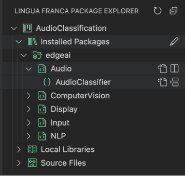
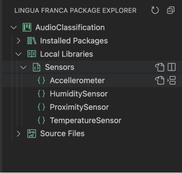
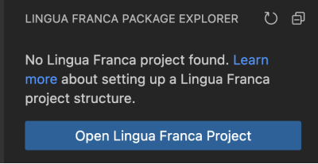

The Lingua Franca extension for Visual Studio Code (VS Code) provides syntax-directed editing capability, compilation, diagram synthesis and a package explorer for Lingua Franca programs.

## Usage

### Creating a new file

To create a new LF file, go to <kbd>File > New File...</kbd> and select `New Lingua Franca File`. When saving the file, save it in a directory called `src` to make sure that generated code is placed conveniently in an adjacent `src-gen` directory. For instance, for a file called `Foo.lf`, the directory structure after building should look something like this:

```
bin/Foo
src/
└ Foo.lf
src-gen/Foo
```

Overall, we encourage you to open your project in VS Code using the following structure to fully leverage the features of the VS Code extension:

```
├── root
│   ├── bin/
│   ├── build/   # directory containing packages installed by Lingo Package Manager
│   │  ├── lfc_include/ # Directory for storing reusable reactors
│   │  │   ├── installed_library/
│   ├── include/
│   ├── src/
│   │  ├── lib/ # Directory for storing reusable reactors
│   │  │   ├── Input.lf # Ex: reactor capturing external inputs (e.g., Microphone, Camera)
│   │  │   └── ComputerVision.lf # Ex: reactor performing computer vision tasks (e.g., object detection, face recognition)
└── └── Lingo.toml # Configuration file for Lingo Package Manager
```

### Rendering diagrams

To show the diagram for the currently active Lingua Franca file, click on the diagrams icon at the upper right:

### Compilation

To compile the `.lf` source, open the command palette (<kbd>Ctrl</kbd> + <kbd>Shift</kbd> + <kbd>P</kbd>) and then enter `Lingua Franca: Build`.

### Running

You can also build and immediately afterwards run your code by opening the command palette (<kbd>Ctrl</kbd> + <kbd>Shift</kbd> + <kbd>P</kbd>) and then entering `Lingua Franca: Build and Run`.
Running the code can also be done from the VS Code terminal by executing the generated file in `./bin`.

### Packages Explorer

The **Lingua Franca Package Explorer** can be accessed by clicking on the **LF icon** in the activity bar on the left side of the screen. Once opened, the **Package Explorer** displays a **Tree View** with the following structure:

```
├── LF Project
│   ├── Installed Packages
│   ├── Local Libraries
└── └── Source Files
```

- [**Installed Packages**](#installed-packages): Lists libraries installed via the Lingo Package Manager, located in the `build/lfc_include` directory (if any).
  
- [**Local Libraries**](#local-libraries): Displays locally defined libraries (e.g., reusable reactors), located in the `src/lib` directory.
  
- [**Source Files**](#source-files): Contains the LF source files created by the developer, located in the `src` directory.

The **Source Files** section is always present as it reflects the main LF files in the project. However, the **Installed Packages** and **Local Libraries** sections appear only if the respective directories and files exist in the workspace.

Hovering over the **LF Project** item reveals a terminal icon. Clicking this icon opens a terminal window at the project's root directory, allowing you to execute commands directly within that directory.

#### Installed Packages

The **Installed Packages** section lists libraries installed using the [Lingo Package Manager](https://github.com/lf-lang/lingo). Developers can use the Lingo Package Manager to retrieve and install LF programs from repositories such as the [Lingua Franca Community Organization](https://github.com/LF-Community).

To install libraries:
1. Configure the `Lingo.toml` file with the desired libraries.
2. Run `lingo build` to download the specified dependencies.

Once the libraries are installed, they will appear in the `{project_name}/build/lfc_include/` directory. The **Installed Packages** section will then be structured as follows:

```
├── LF Project
│   ├── Installed Packages
│   │  ├── installed_library/
│   │  │   ├── File_1.lf
│   │  │   │   ├── Rusable_Reactor_1.lf
│   │  │   │   ├── Rusable_Reactor_2.lf
│   │  │   ├── File_2.lf
│   │  │   │   ├── Rusable_Reactor_1.lf
│   │  │   │   ├── Rusable_Reactor_2.lf
...
```

In this structure:
- **LF Project**: Represents the root folder of the main project.
- **installed_library**: Represents each library listed in `Lingo.toml`, which contains one or more LF programs featuring reusable reactors.

The image below shows a visual representation of the **Installed Packages** section. The **project** icon indicates the LF Project folder (e.g., `AudioClassification`), while the **root-folder** icon represents the downloaded libraries (e.g., the `edgeai` library in the example). The **code file** icon denotes an LF program within a library, and the **bracket** icon represents individual reactors inside the LF program.



The hierarchy categorizes tree items into the following types:

1. **`library-root`**: Refers to the root folder of each downloaded library.
2. **`file`**: Represents an LF program within the library.
3. **`reactor`**: Refers to individual reactors within the LF program.

When focusing on the **Installed Packages** section, an `edit` command becomes available. Clicking it opens the `Lingo.toml` file in the editor for configuration changes. The following actions are available for items in the **Installed Packages** section:

- For **file** items (from right to left):
  - **Open in Split View**: Opens the file in a split editor view.
  - **Go To File**: Navigates to the file in the editor.
  
- For **reactor** items (from right to left):
  - **Import Selected Reactor**: Imports the selected reactor into the active LF program.
  - **Go To File**: Opens the file where the reactor is defined.
  - **Open in Split View**: Opens the file in a split editor view (accessible by right-clicking the item).

:::note
The **Import Selected Reactor** option is available only if an LF program is open in the editor.
:::

#### Local Libraries

The **Local Libraries** section lists LF programs created by the developer, located in the `{project_name}/src/lib/` directory. These programs serve as local libraries, containing reusable reactors. The directory structure follows this format:

```
├── LF Project
...
│   ├── Local Libraries
│   │  ├── File_1.lf
│   │  │   ├── Rusable_Reactor_1.lf
│   │  │   ├── Rusable_Reactor_2.lf
│   │  ├── File_2.lf
│   │  │   │   ├── Rusable_Reactor_1.lf
│   │  │   │   ├── Rusable_Reactor_2.lf
...
```

The image below illustrates the **Local Libraries** section. In this depiction, the **"project"** icon represents the LF project folder, while the **"code file"** icon represents the LF program, and the **"bracket"** icon denotes individual reactors within the LF program.



The hierarchy categorizes tree items into two types:

1. **`file`**: Represents the LF program.
2. **`reactor`**: Represents a reactor within the LF program.

Actions for **Local Libraries** are similar to those in the [**Installed Packages**](#installed-packages) section:

- For **file** items (from right to left):
  - **Open in Split View**: Opens the file in a split editor view.
  - **Go To File**: Navigates to the file in the editor.
  
- For **reactor** items (from right to left):
  - **Import Selected Reactor**: Imports the selected reactor into the active LF program.
  - **Go To File**: Opens the file where the reactor is defined.
  - **Open in Split View**: Opens the file in a split editor view (accessible by right-clicking the item).

> **Note**: The **Import Selected Reactor** option is available only if an LF program is open in the editor.

#### Source Files

The **Source Files** section lists all LF programs in the `{project_name}/src/` directory. This section provides direct access to the main source files of the project. The hierarchy for this view is straightforward:

```
├── LF Project
...
│   ├── Local Libraries
│   │  ├── File_1.lf
│   │  ├── File_1.lf
│   │  ├── File_1.lf
...
```

Clicking on any of the files will open the corresponding LF program in the editor, allowing developers to quickly navigate to and edit the source code of their project.

#### Correctness of Project Structure

If the project structure deviates from the expected format, an error message will appear:



To avoid errors, follow the [project structure guidelines](#creating-a-new-file).

## Notes

### For Python Users

Users who edit LF programs with a Python target will benefit the most from Python linting by installing Pylint 2.12.2 or later.