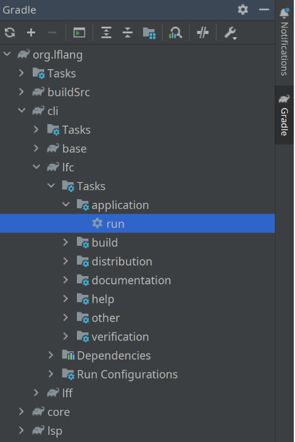
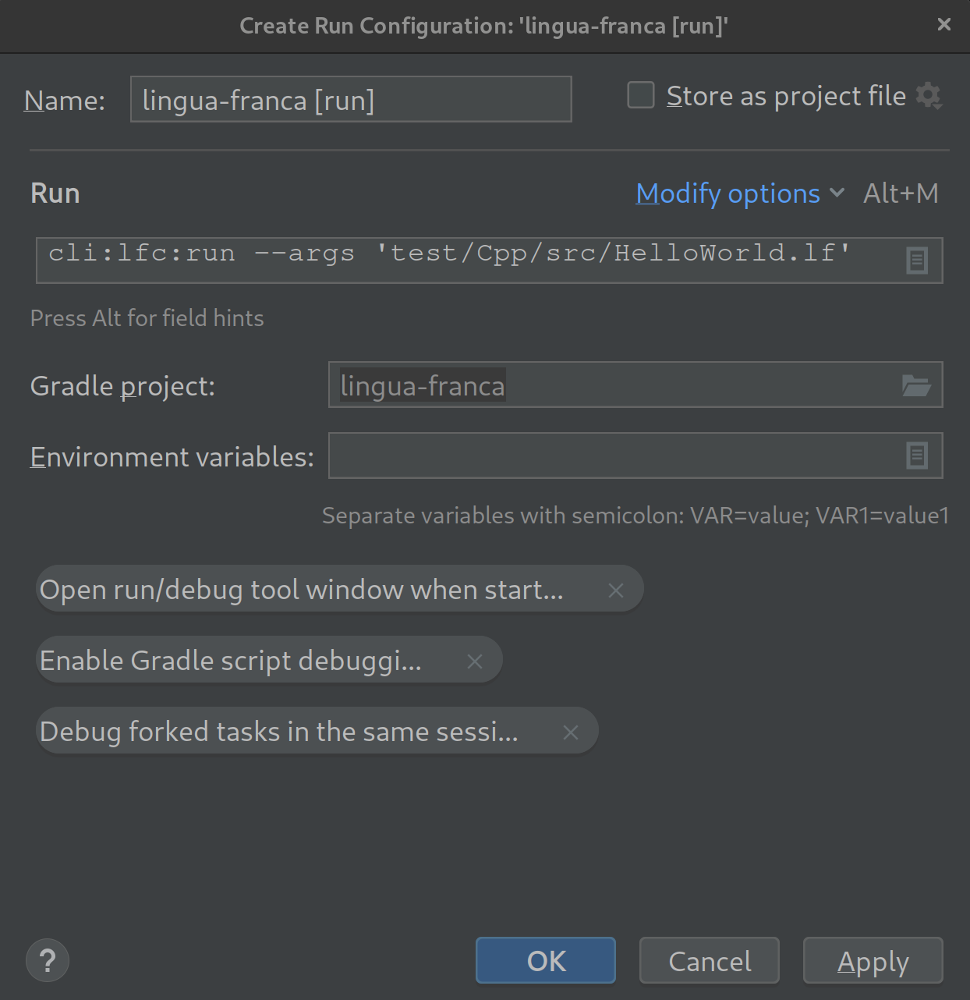

## Prerequisites

- Java 17 or up ([download from Oracle](https://www.oracle.com/java/technologies/downloads/))
- IntelliJ IDEA Community Edition ([download from Jetbrains](https://www.jetbrains.com/idea/download/))

## Cloning lingua-franca repository

If you have not done so already, clone the lingua-franca repository into your working directory.

```sh
$ git clone git@github.com:lf-lang/lingua-franca.git lingua-franca
$ cd lingua-franca
$ git submodule update --init --recursive
```

## Opening lingua-franca as IntelliJ Project

To import the Lingua Franca repository as a project, simply run `./gradew openIdea`.
This will create some project files and then open the project in IntelliJ.

When you open the project for the first time, you will see a small pop-up in the lower right corner.


Click on "Load Gradle Project" to import the Gradle configurations.

If you are prompted to a pop-up window asking if you trust the Gradle project, click Trust Project.


Once the repository is imported as a Gradle project, you will see a Gradle tab on the right.

Once the indexing finishes, you can expand the Gradle project and see the set of Tasks.



## Setting up run configurations

You can set up a run configuration for running and debugging various Gradle tasks from the Gradle tab, including the code generation through lfc.
To set up a run configuration for the run task of lfc, right-click on "run" under org.lflang -> cli -> lfc -> Tasks -> application and click "Modify Run Configuration".
This will create a custom run/debug configuration for you.

In the Run/Debug Configurations dialog, click on the text box next to Tasks: and append args to specify the LF target. For example, `run --args 'test/Cpp/src/HelloWorld.lf'` Then click OK.



You will see a new run/debug config added to the top-level menu bar, as shown below.
You can always change the config, for example, changing the args, by clicking `Edit Configurations` via a drop-down menu.


## Running and Debugging

Using the newly added config, you can run and debug the code generator by clicking the play button and the debug button.


Set up breakpoints before starting the debugger by clicking the space right next to the line numbers.
While debugging, you can run code step-by-step by using the debugger tools.


