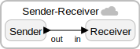

<div class="lf-c">

## ROS 2 Interoperability

The C target has several features that would allow you to mostly re-use your existing rclcpp-based ROS 2 nodes with minimal required changes:

- **`CCpp` target:** Since you might want to write C++ code and interact with
  C++ libraries, we have added a special [CCpp
  target](/docs/handbook/target-language-details#the-target-specification)
  that uses the C runtime under the hood and the existing CMake build system in
  the C target. However, the CCpp target uses a C++ compiler instead of a C
  compiler. To use the CCpp target, simply declare your target as
  ```lf-c
  target CCpp <options>;
  ```
- **Interoperability with Colcon:** The C target uses the same underlying build
  system as `colcon` (and `ament`), and thus can nicely interoperate with
  CMake-based ROS packages (which include most C/C++ packages). To add an existing ROS
  package or node as a build dependency, you could make use of the
  [`cmake-include`](/docs/handbook/target-declaration#cmake) target parameter.
  For example, to use `rclcpp`, you could do the following:

  ```lf-c
  target CCpp {
      cmake-include: ["rclcpp-support.cmake",]
  };
  ```

  And write the `rclcpp-support.cmake` as follows:

  ```lf-c
  find_package(ament_cmake REQUIRED)
  find_package(rclcpp REQUIRED)
  ament_target_dependencies(${LF_MAIN_TARGET} rclcpp)
  ```

  Note the use of `ament_target_dependencies`, which is not a built-in CMake
  method. `ament_target_dependencies` is a CMake method that is provided as part
  of the
  [`ament_cmake`](https://docs.ros.org/en/humble/How-To-Guides/Ament-CMake-Documentation.html#ament-cmake-user-documentation)
  package and is more or less a shortcut for including and linking target
  dependencies (including any relevant directories that may contain header
  files).

  Also note that ROS setup files should be properly [sourced](https://docs.ros.org/en/humble/Tutorials/Configuring-ROS2-Environment.html#source-the-setup-files) in order for `rclcpp` to be findable.

- **Built-in Support for ROS 2 Message Types:** The CCpp target has built-in
  support for ROS 2 message (and service) types. Messages are still transported
  on (deterministic) Lingua Franca connections, but reactor ports can have ROS
  2 message (or service) types. In federated execution, rclcpp's serializer is
  transparently used to serialize messages.

  For example, you could write a
  simple Lingua Franca program where a `Sender` reactor sends a
  `std_msgs::msg::Int32` to a `Receiver` reactor as follows:

  ```lf-c
  target CCpp {
      cmake-include: ["ros-support.cmake",]
  };
  preamble {=
      #include "std_msgs/msg/int32.hpp"
  =}
  reactor Sender {
      output out:std_msgs::msg::Int32;
      reaction (startup) -> out {=
          std_msgs::msg::Int32 ros_message;
          ros_message.data = 1;
          lf_set(out, ros_message);
      =}
  }
  reactor Receiver {
    input in:std_msgs::msg::Int32;
    reaction (in) {=
        // Print the ROS2 message data
        lf_print("Received: %d", in->value.data);
    =}
  }
  federated reactor { // Also works with main
      sender = new Sender();
      receiver = new Receiver();
      sender.out -> receiver.in serializer "ros2";
  }
  ```

  

  The `ros-support.cmake` simply contains:

  ```lf-c
  find_package(std_msgs REQUIRED)
  ament_target_dependencies(${LF_MAIN_TARGET} std_msgs)
  ```

  Note the use of `serializer "ros2"` on the connection between the sender and
  receiver. This tells the Lingua Franca compiler what serializer it should use
  on the connection.

  Also note the minimal content of `ros-support.cmake` (notably with `rclcpp`
  being absent). Because of the usage of `serializer "ros2"`, the Lingua Franca
  compiler will automatically add basic ROS 2 packages (`ament_cmake`, `rclcpp`,
  `rclcpp_components`, `rcutils`, and `rmw`) as build dependencies.

  Finally, as a reminder, please note that ROS setup files should be properly
  [sourced](https://docs.ros.org/en/humble/Tutorials/Configuring-ROS2-Environment.html#source-the-setup-files)
  in order for `std_msgs` to be findable.

  Support for `shared_ptr` types is also supported. It is generally could be
  more efficient to use shared pointers because they can minimize the overhead
  of copying. This would especially be useful for message types such as
  `PointCloud2` that are expensive to copy. The example above could be
  re-written as:

  ```lf-c
  target CCpp {
      cmake-include: ["ros-support.cmake",]
  };
  preamble {=
      #include <memory>
      #include "std_msgs/msg/int32.hpp"
  =}
  reactor Sender {
      output out:std::shared_ptr<std_msgs::msg::Int32>;
      reaction (startup) -> out {=
          auto ros_message = std::make_shared<std_msgs::msg::Int32>();
          ros_message->data = 1;
          lf_set(out, ros_message);
      =}
  }
  reactor Receiver {
      input in:std::shared_ptr<std_msgs::msg::Int32>;
      reaction (in) {=
          // Print the ROS2 message data
          lf_print("Received: %d", in->value->data);
      =}
  }
  federated reactor {
      sender = new Sender();
      receiver = new Receiver();
      sender.out -> receiver.in serializer "ros2";
  }
  ```

## Porting ROS 2 Nodes to Lingua Franca

In addition to using ROS 2 packages in your Lingua Franca programs, you could
also take steps to port existing ROS 2 nodes to Lingua Franca. Ultimately,
Lingua Franca can take over the communication and the event handling control
loop of existing ROS 2 nodes to enable deterministic execution.

Here, we show the required steps to port the publisher and subscriber nodes in
ROS 2's [`minimal composition`](https://github.com/ros2/examples/tree/master/rclcpp/composition/minimal_composition)
example to Lingua Franca. The instructions are written with the assumption that
you would be using Ubuntu 22.04 and ROS 2 Humble. However, the overall steps
should work on all non-deprecated and fully supported ROS 2
[distributions](https://docs.ros.org/en/humble/Releases.html).

### Step 1: Put the ROS 2 node inside a reactor

- Step 1: [Install ROS 2](https://docs.ros.org/en/humble/Installation.html).
- Step 2: [Install LFC](/docs/handbook/command-line-tools).
- Step 3: Create a folder that would contain everything. For example:

  ```bash
  mkdir ~/lf-ros-demo/
  cd ~/lf-ros-demo
  ```

- Step 4: Clone the ROS 2 examples repository:

  ```bash
  git clone --branch humble git@github.com:ros2/examples.git
  # Navigate to where minimal_composition located
  cd examples/rclcpp/composition/minimal_composition
  ```

  Note the inclusion of `--branch humble` above. You would want to clone the
  branch that corresponds to your ROS distribution.

- Step 5: [Source the appropriate setup file for your system](https://docs.ros.org/en/humble/Tutorials/Configuring-ROS2-Environment.html#source-the-setup-files). For example:

  ```bash
  source /opt/ros/humble/setup.bash
  ```

- Step 6: Build and source the project (see the note below).

  ```bash
  colcon build --allow-overriding examples_rclcpp_minimal_composition
  source install/setup.bash
  ```

  **Important note:** In most cases `minimal_composition` is already built on your
  system because it comes with the default installation of ROS 2. The
  `--allow-overriding examples_rclcpp_minimal_composition` option allows us to
  override that default installation locally for the purposes of demonstration.
  You won't need this option for your homegrown ROS 2 nodes.

- Step 7: Now, we are going to create a `Sender` reactor that incorporates the
  [`publisher_node`](https://github.com/ros2/examples/blob/master/rclcpp/composition/minimal_composition/src/publisher_node.cpp)
  and a `Receiver` reactor that incorporates the
  [`subscriber_node`](https://github.com/ros2/examples/blob/master/rclcpp/composition/minimal_composition/src/subscriber_node.cpp)
  node.

  - Step 7.1: Create a Lingua Franca [project](/docs/handbook/a-first-reactor#structure-of-an-lf-project):

  ```bash
  mkdir -p ~/lf-ros-demo/lf-project/src
  cd ~/lf-ros-demo/lf-project/src
  ```

  - Step 7.2: Use any of our [editors](/download) to create a
    `Sender.lf` and a `Receiver.lf` file with the following content:

    ```lf-c
    // ~/lf-ros-demo/lf-project/src/Sender.lf
    target CCpp {
      cmake-include: "include/composition.cmake"
    };
    preamble {=
      #include <memory>
      #include "minimal_composition/publisher_node.hpp"
      #include "rclcpp/rclcpp.hpp"
      #include "std_msgs/msg/string.hpp"
    =}
    reactor Sender {
      // Instantiate the publisher node as a sate variable
      state publisher_node : std::shared_ptr<PublisherNode>;
      reaction(startup) {=
        // Initialize rclcpp
        rclcpp::init(0, NULL);
        // Instantiate the ROS node
        // Note: Sending messages is still done in ROS
        self->publisher_node = std::make_shared<PublisherNode>(rclcpp::NodeOptions());
        // Start the rclcpp's event handling loop
        // Event handling is still done in ROS
        rclcpp::spin(self->publisher_node);
      =}
      reaction(shutdown) {=
        rclcpp::shutdown();
      =}
    }

    ```

    ```lf-c
    // ~/lf-ros-demo/lf-project/src/Receiver.lf
    target CCpp {
      cmake-include: "include/composition.cmake"
    };
    preamble {=
      #include <memory>
      #include "minimal_composition/subscriber_node.hpp"
      #include "rclcpp/rclcpp.hpp"
      #include "std_msgs/msg/string.hpp"
    =}
    reactor Receiver {
      // Instantiate the subscriber node as a sate variable
      state subscriber_node : std::shared_ptr<SubscriberNode>;
      reaction(startup) {=
        // Initialize rclcpp
        rclcpp::init(0, NULL);
        // Instantiate the ROs node
        // Note: Receiving messages is still done in ROS
        self->subscriber_node = std::make_shared<SubscriberNode>(rclcpp::NodeOptions());
        // Start the rclcpp's event handling loop
        // Event handling is still done in ROS
        rclcpp::spin(self->subscriber_node);
      =}
      reaction(shutdown) {=
        rclcpp::shutdown();
      =}
    }
    ```

    Since reactors are composable, you could create a [federated]() program that
    incorporates both the Sender and the Receiver:

    ```lf-c
    // ~/lf-ros-demo/lf-project/src/Main.lf
    target CCpp;

    import Sender from "Sender.lf"
    import Receiver from "Receiver.lf"

    federated reactor {
        sender = new Sender();
        receiver = new Receiver();
    }

    ```

    **FIXME:** Following the steps above will cause the following error:
    "undefined reference to
    `SubscriberNode::SubscriberNode(rclcpp::NodeOptions)'".

    As you may have noticed, the Sender and Receiver reactors above do nothing
    more than instantiating the PublisherNode and SubscriberNode respectively
    and still rely on `rclcpp::spin()`, which starts the main event handling
    loop of rclcpp, to process events and send and receive messages. Next, we
    take steps to take over the message passing.

### Step 2: Take over the communication of the node

At a high level, the ROS communication framework is built on top of the pub-sub
paradigm. This is in contrast to Lingua Franca, which uses
[ports](http://localhost:8000/docs/handbook/inputs-and-outputs) and
[connections](http://localhost:8000/docs/handbook/composing-reactors#connections)
to facilitate communication between reactors.

However, there is a methodical way of encapsulating ROS connections between nodes in Lingua
Franca reactors:

1. For each topic that a ROS node subscribes to, create an input port in the
   encompassing reactor.
2. For each callback of each topic, create a reaction that simply calls the
   callback function (akin to forwarding the message).
3. For each topic that a ROS node publishes to, create an output port in the
   encompassing reactor.
4. Replace the many-to-many connections between ROS nodes with one-to-many and
   one-to-one connections in Lingua Franca.

These steps can be applied to the minimal_composition example, creating the
following two reactors:

```lf-c
// ~/lf-ros-demo/lf-project/src/Sender.lf
target CCpp {
    cmake-include: "include/composition.cmake"
};
preamble {=
    #include <memory>
    #include "minimal_composition/publisher_node.hpp"
    #include "rclcpp/rclcpp.hpp"
    #include "std_msgs/msg/string.hpp"
=}
reactor Sender {
    // Instantiate the publisher node as a sate variable
    state publisher_node : std::shared_ptr<PublisherNode>;
    output out:std_msgs::msg::String;
    timer t(0, 1 sec);
    state count:int(0);
    reaction(startup) {=
        // Initialize rclcpp
        // rclcpp::init(0, NULL);
        // Instantiate the ROS node
        // self->publisher_node = std::make_shared<PublisherNode>(rclcpp::NodeOptions());
    =}
    reaction(t) -> out {=
        auto message = std_msgs::msg::String();
        message.data = "Hello, world! " + std::to_string(self->count++);
        lf_set(out, message);
    =}
    reaction(shutdown) {=
        rclcpp::shutdown();
    =}
}
```

```lf-c
// ~/lf-ros-demo/lf-project/src/Receiver.lf
target CCpp {
    cmake-include: "include/composition.cmake"
};
preamble {=
    #include <memory>
    #include "minimal_composition/subscriber_node.hpp"
    #include "rclcpp/rclcpp.hpp"
    #include "std_msgs/msg/string.hpp"
=}
reactor Receiver {
    // Instantiate the subscriber node as a sate variable
    state subscriber_node : std::shared_ptr<SubscriberNode>;
    input in:std_msgs::msg::String;
    reaction(startup) {=
        // Initialize rclcpp
        rclcpp::init(0, NULL);
        // Instantiate the ROS node
        self->subscriber_node = std::make_shared<SubscriberNode>(rclcpp::NodeOptions());
    =}
    reaction(in) {=
        lf_print("Received %s", in->value.data.c_str());
        self->subscriber_node->topic_callback(in->value);
    =}
    reaction(shutdown) {=
        rclcpp::shutdown();
    =}
}
```

```lf-c
// ~/lf-ros-demo/lf-project/src/Main.lf
target CCpp;

import Sender from "Sender.lf"
import Receiver from "Receiver.lf"

federated reactor {
    sender = new Sender();
    receiver = new Receiver();
    sender.out -> receiver.in serializer "ROS2";
}
```

**FIXME**: Add figures for the examples above.

</div>

<div class="lf-cpp">
FIXME: @cmnrd
</div>

<div class="lf-py">
ROS integration with the Python target is still under development.
</div>

<div class="lf-ts lf-rs">
ROS integration for the selected target is not yet supported.
</div>
