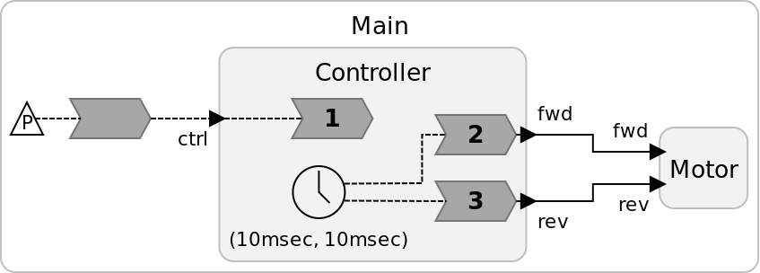
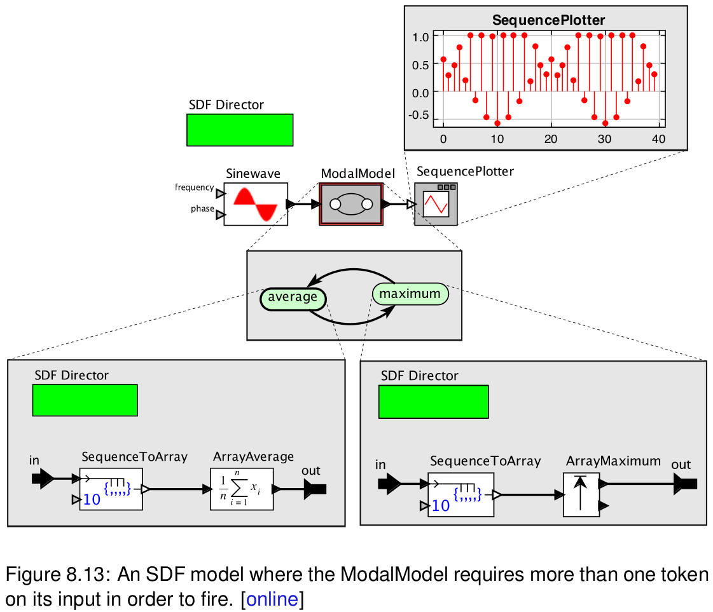
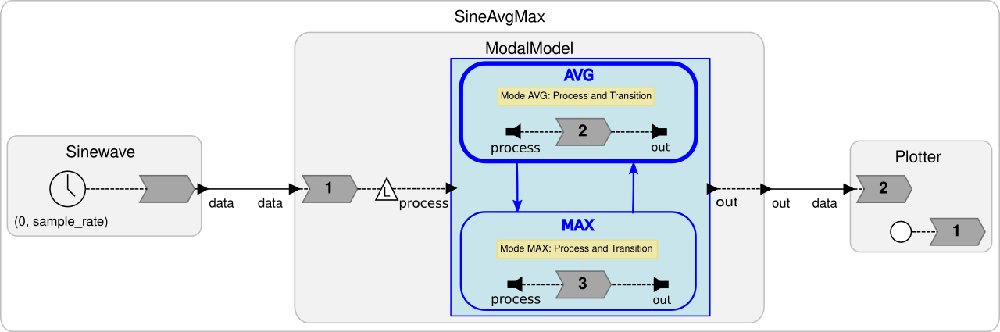

Possible concept for supporting modes in LF.

## Motivation

- Structured behavior
  - Both in text and diagrams
  - Built-in state machines
- Dependencies
  - Accept cyclic dependencies if involved reactions are mutually exclusive.
- Verification
  - Mode-dependent invariants / conditions

### Synthetic Examples



Separating reaction 2 and 3 of the Controller reactor into mutually exclusive modes could allow to ensure via static verification that at no time the Motor reactor receives a `fwd` and `rev` input simultaneously.


Separating reaction 2 and 3 of the Modes reactor into mutually exclusive modes could allow to accept this program.

## Design Considerations

- LF does not provide an expression/statement language.
- Only Reactions can access variables and ports via the respective target language API and target code should not be analyzed.
- Information about modes and their transitions must be available statically in LF to facilitate the dependency analysis and verification.

For this proposal, the aim is (at least so far) not to create a state machine syntax with an abstract expression/statement language for triggers and effects that is compiled into target code but to reuse elements of the current polyglot approach.

## Basic Syntax Proposal

Reactors may contain (two or more) mode definitions:

- A mode provides a unique ID (in the reactor scope)
- May consist of (only for simplicity at this point):
  - Reactions
  - Reactor instantiations (under the same restrictions)
  - Connections
- It shares the scope with the reactor but not with other modes
- One mode must be marked as _initial_

```
reactor TwoModes {
  initial mode One {
    ...
  }
  mode Two {
    ...
  }
}
```

Reactions in modes may declare a transition to (one or more) modes.

- This enables the use of target language API to set the next state (e.g. set_mode(X))

```
reaction(trig) transition Two {=
  if (trig->value) {
    set_mode(Two)
  }
=}
```

### Graphical Syntax


The example continuously collects 10 data samples of a sine wave and computes either the average or maximum. [LF source code](https://github.com/lf-lang/lingua-franca/blob/master/experimental/modal_models/SineAvgMax/sine_max_avg.lf). It is based on this [Ptolemy model with modes](http://ptolemy.org/systems/models/modal/ModalSDF/index.html).



Note that reactions 1 and 3 are identical and both collect a sequence into an array. This was done to mimic the structure in Ptolemy. An alternative design could separate this task into a single reaction outside the modes (following image, [source code](https://github.com/lf-lang/lingua-franca/blob/master/experimental/modal_models/SineAvgMax/sine_max_avg_v2.lf)) or into a reactor either instantiated in each mode or preprocessing inputs for the ModalModel reactor.



## Possible Execution Model

- The initial mode will be active upon reactor startup. Others will be inactive.

- All reactions in inactive modes will not be triggered.

  - Reactions will not enter reaction queue.
  - Includes reactions in contained reactor instances.
  - **Q: What about "relay reactions" for connections, should the be suppressed as well?**

- If at a logical time (t, m) **(See Q1)** all reactions are finished and a different mode was set, the current mode will be deactivated and the new one will be activated. No newly activated reactions will be triggered based on current inputs **(See Q1)**. All contained modes will be reset to their initial state **(See Q2 and Q5)**. All internal events/actions previously scheduled by contents of this new mode will be removed **(Q: Better freeze them and introduce a mode local time line?)**.
  - This could also be implemented by mutations, deleting the content of the deactivated mode and adding the content of the new mode.

## Questions

- **Q1:** When to switch modes? 4 alternatives ordered by "immediacy":
  1. _Immediate_: This will switch modes immediately such that source and target mode will be active simultaneously. This will primarily prescribe an order for the reactions in modes instead of establishing mutual exclusion.
  2. _Micro Step_ (current proposal): If a new mode is set at (t, m) this mode will be active at (t, m + 1).
  3. _Logical Time_: Only one mode is active at all micro steps of a logical time tag t. The main question is at what time will be the next reaction, as this might depend on external inputs.
  4. _Explicit Delay_: Setting a mode takes an explicit delay (like lf_schedule) when to take the transition. Problem here is invalidating scheduled transitions by earlier ones.
- **Q2:** Do we want hierarchy?
  - Proposal: Yes!
- **Q3:** Hybrid Reactions
  - Mixing modes and reaction outside of modes in the same reactor (not done in Ptolemy/SCADE/SCCharts).
  - Might facilitate proper startup / shutdown of a reactor.
- **Q4:** Preemption
  - Triggering transitions by reactions requires an active mode. This allows "weak" preemption but rules out "strong" preemption.
  - Executing all reactions allows overruling previously set target modes. This might be unintuitive compared to transitions and priorities. An **alternative** might be stopping reaction execution when a mode switch was triggered.
- **Q5:** Do we want history transitions?
  - What about reacting to events/actions scheduled in previous activations of a mode?

## Observations

- Having reactions with transition dependencies in modes allows to infer outgoing transitions of this mode.

- Using reactor instances in modes allows to model hierarchical modes.

- Having the actual triggering of an transition in reaction code only exposes which reaction triggers _might_ trigger the transition.

- Marking modes as initial in LF enables proper code generation for a hierarchical reset. A more flexible **alternative** would be setting the initial mode in startup reactions. This would allow different initial states but would require target code parsing.

- Restricting use of modes in reactions (set_mode) may require target code parsing.

- Triggering transitions in a deadline block of a reaction corresponds to error transitions (Ptolemy).

## Possible Extensions

- **Actions:** Might be trivial as reactions to actions will be suppressed if mode is inactive. Actions scheduled in the future must be removed when entering mode.

- **Local State Variables**: Requires initial value or a special reset reaction to properly reset the state when mode is reentered.

- **Timers:**: Start/Restart when mode is entered. Feasibility depends on the timing of mode activation activation **(See Q1)**.

- **History Transitions:**

  - Do not remove events/actions that were scheduled when the state was previously active.
  - Do not reset modes in contained reactors to initial (deep history)?
  - Omit triggering reset actions for state variables.
  - Timers are restored, not restarted.

- **Immediate Transitions:** See **Q1**

- **Entry/Exit Triggers:** Special trigger for reactions to pre/post-process entering/leaving of modes.

## Optional Syntactic Sugar for (flat) FSMs

```
reactor TwoModes {
  initial state One {...} //<-- optional (would introduce hierarchy)
  transition(TRIG) READ -> WRITE to Two
    if {= GUARD =} //<-- optional
    with {= EFFECT =} //<-- optional

  state Two
}
```

Transformed into:

```
initial mode One {
  reaction ($TRIG) $READ -> $WRITE transition Two {=
    if ($GUARD) { //<-- target language specific code generation
      set_mode(Two)
      $EFFECT //<-- Does not work with multiple triggering transitions as all effects would be executed (not only taken transtions, see Q4)
    }
  =}
}
mode Two {
}
```
