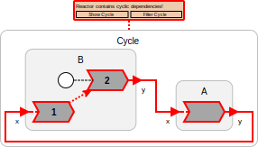

## Cycles

The interconnection pattern for a collection of reactors can form a cycle, but some care is required. Consider the following example:

$start(Cycle)$

```lf-c
target C;
reactor A {
    input x:int;
    output y:int;
    reaction(x) -> y {=
        // ... something here ...
    =}
}
reactor B {
    input x:int;
    output y:int;
    reaction(x) {=
        // ... something here ...
    =}
    reaction(startup) -> y {=
        // ... something here ...
    =}
}
main reactor {
    a = new A();
    b = new B();
    a.y -> b.x;
    b.y -> a.x;
}
```

```lf-cpp
WARNING: No source file found: ../code/cpp/src/Cycle.lf
```

```lf-py
WARNING: No source file found: ../code/py/src/Cycle.lf
```

```lf-ts
WARNING: No source file found: ../code/ts/src/Cycle.lf
```

```lf-rs
WARNING: No source file found: ../code/rs/src/Cycle.lf
```

$end(Cycle)$

This program yields the following diagram:



The diagram highlights a **causality loop** in the program. At each tag, in reactor `B`, the first reaction has to execute before the second if it is enabled, a precedence indicated with the red dashed arrow. But the first can't execute until the reaction of `A` has executed, and that reaction cannot execute until the second reaction `B` has executed. There is no way to satisfy these requirements, so the tools refuse to generated code.

## Cycles with Delays

One way to break the causality loop and get an executable program is to introduce a [logical delay](/docs/handbook/composing-reactors#connections-with-logical-delays) into the loop, as shown below:

$start(CycleWithDelay)$

```lf-c
target C;
reactor A {
    input x:int;
    output y:int;
    reaction(x) -> y {=
        // ... something here ...
    =}
}
reactor B {
    input x:int;
    output y:int;
    reaction(x) {=
        // ... something here ...
    =}
    reaction(startup) -> y {=
        // ... something here ...
    =}
}
main reactor {
    a = new A();
    b = new B();
    a.y -> b.x after 0;
    b.y -> a.x;
}
```

```lf-cpp
WARNING: No source file found: ../code/cpp/src/CycleWithDelay.lf
```

```lf-py
WARNING: No source file found: ../code/py/src/CycleWithDelay.lf
```

```lf-ts
WARNING: No source file found: ../code/ts/src/CycleWithDelay.lf
```

```lf-rs
WARNING: No source file found: ../code/rs/src/CycleWithDelay.lf
```

$end(CycleWithDelay)$


Here, we have used a delay of 0, which results in a delay of one [microstep](/docs/handbook/superdense-time). We could equally well have specified a positive time value.

## Reaction Order

Frequently, a program will have such cycles, but you don't want a logical delay in the loop. To get a cycle without logical delays, the reactions need to be reordered, as shown below:

$start(CycleReordered)$

```lf-c
target C;
reactor A {
    input x:int;
    output y:int;
    reaction(x) -> y {=
        // ... something here ...
    =}
}
reactor B {
    input x:int;
    output y:int;
    reaction(startup) -> y {=
        // ... something here ...
    =}
    reaction(x) {=
        // ... something here ...
    =}
}
main reactor {
    a = new A();
    b = new B();
    a.y -> b.x;
    b.y -> a.x;
}
```

```lf-cpp
WARNING: No source file found: ../code/cpp/src/CycleReordered.lf
```

```lf-py
WARNING: No source file found: ../code/py/src/CycleReordered.lf
```

```lf-ts
WARNING: No source file found: ../code/ts/src/CycleReordered.lf
```

```lf-rs
WARNING: No source file found: ../code/rs/src/CycleReordered.lf
```

$end(CycleReordered)$


There is no longer any causality loop.
