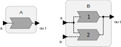

$page-showing-target$

## Extending a Base Reactor

<div class="lf-cpp">

**The Cpp target does not yet support extending reactors.**

</div>

<div class="lf-c lf-py lf-ty lf-rs">

Lingua Franca supports defining a reactor class as an extension (or subclass), as in the following example:

$start(Extends)$

```lf-c
target C;
reactor A {
    input a:int;
    output out:int;
    reaction(a) -> out {=
        SET(out, a->value);
    =}
}
reactor B extends A {
    input b:int;
    reaction(a, b) -> out {=
        SET(out, a->value + b->value);
    =}
}

```

```lf-cpp
// the cpp target currently does not support reactor extends
```

```lf-py
WARNING: No source file found: ../code/py/src/Extends.lf
```

```lf-ts
WARNING: No source file found: ../code/ts/src/Extends.lf
```

```lf-rs
WARNING: No source file found: ../code/rs/src/Extends.lf
```

$end(Extends)$



Here, the base class `A` has a single output that it writes to in reaction to an input. The subclass inherits the input, the output, and the reaction of `A`, and adds its own input `b` and reaction. When an input event `a` arrives, both reactions will be invoked, but, once again, in a well-defined order. The reactions of the base class are invoked before those of the derived class. So in this case, `B` will overwrite the output produced by `A`.

One limitation is that a subclass cannot have ports, actions, or state variables with the same names as those in the base class. The names must be unique.

A subclass can extend more than one base class by just providing a comma-separated list of base classes. If reactions in multiple base classes are triggered at the same tag, they will be invoked in the same order that they appear in the comma-separated list.

</div>
