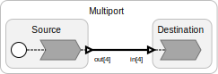
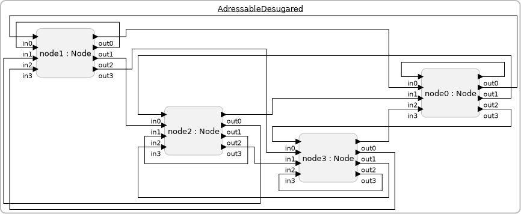
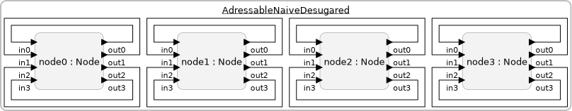

$page-showing-target$

Lingua Franca provides a compact syntax for ports that can send or receive over multiple channels and another syntax for multiple instances of a reactor class. These are respectively called **multiports** and **banks of reactors**.

## Multiports

To declare an input or output port to be a **multiport**, use the following syntax:

<div class="lf-c lf-cpp lf-rs">

```lf
    input[<width>] <name>:<type>;
    output[<width>] <name>:<type>;
```

</div>

<div class="lf-ts lf-py">

```lf
    input[<width>] <name>
    output[<width>] <name>
```

</div>

where `<width>` is a positive integer. This can be given either as an integer literal or a parameter name. <span class="lf-cpp"> The width can also be given by target code enclosed in `{=...=}`.</span> Consider the following example:

$start(Multiport)$

```lf-c
target C;
reactor Source {
    output[4] out:int;
    reaction(startup) -> out {=
        for(int i = 0; i < out_width; i++) {
            SET(out[i], i);
        }
    =}
}
reactor Destination {
    input[4] in:int;
    reaction(in) {=
        int sum = 0;
        for (int i = 0; i < in_width; i++) {
            if (in[i]->is_present) sum += in[i]->value;
        }
        printf("Sum of received: %d.\n", sum);
    =}
}
main reactor {
    a = new Source();
    b = new Destination();
    a.out -> b.in;
}

```

```lf-cpp
target Cpp;
reactor Source {
    output[4] out:int;
    reaction(startup) -> out {=
        for(auto i = 0ul; i < out.size(); i++) {
            out[i].set(i);
        }
    =}
}
reactor Destination {
    input[4] in:int;
    reaction(in) {=
        int sum = 0;
        for (auto i = 0ul; i < in.size(); i++) {
            if (in[i].is_present()){
                sum += *in[i].get();
            }
        }
        std::cout << "Sum of received: " << sum << std::endl;
    =}
}
main reactor {
    a = new Source();
    b = new Destination();
    a.out -> b.in;
}

```

```lf-py
WARNING: No source file found: ../code/py/src/Multiport.lf
```

```lf-ts
WARNING: No source file found: ../code/ts/src/Multiport.lf
```

```lf-rs
WARNING: No source file found: ../code/rs/src/Multiport.lf
```

$end(Multiport)$



Executing this program will yield:

```
Sum of received: 6.
```

The `Source` reactor has a four-way multiport output and the `Destination` reactor has a four-way multiport input. These channels are connected all at once on one line, the second line from the last. Notice that the generated diagram shows multiports with hollow triangles. Whether it shows the widths is controlled by an option in the diagram generator.

**NOTE**: In `Destination`, the reaction is triggered by `in`, not by some individual channel of the multiport input. Hence, it is important when using multiport inputs to test for presence of the input on each channel, as done above with the syntax
<span class="lf-c">`if (in[i]->is_present) ...`</span>
<span class="lf-cpp">`if (in[i]->is_present()) ...`</span>
<span class="lf-py lf-ts lf-rs warning">FIXME</span>. An event on any one of the channels is sufficient to trigger the reaction.

The `Source` reactor also specifies `out` as an effect of its reaction using the syntax `-> out`. This brings into scope of the reaction body a way to access the width of the port and a way to write to each channel of the port.

<div class="lf-py">

In the Python target, multiports can be iterated on in a for loop (e.g., `for p in out`) or enumerated (e.g., `for i, p in enumerate(out)`) and the length of the multiport can be obtained by using the `len()` (e.g., `len(out)`) expression.

</div>

## Parameterized Widths

The width of a port may be given by a parameter. For example, the above `Source` reactor can be rewritten

```lf
reactor Source(width:int(4)) {
    output[width] out:int;
    reaction(startup) -> out {=
        ...
    =}
}

```

<div class="lf-cpp">

Parameters to the main reactor can be overwritten on the command line interface when running the generated program. As a consequence, the scale of the application can be determined at run time rather than at compile time.

</div>

## Connecting Reactors with Different Widths

Assume that the `Source` and `Destination` reactors above both use a parameter `width` to specify the width of their ports. Then the following connection is valid:

```lf
main reactor {
    a1 = new Source(width = 3);
    a2 = new Source(width = 2);
    b = new Destination(width = 5);
    a1.out, a2.out -> b.in;
}
```

The first three ports of `b` will received input from `a1`, and the last two ports will receive input from `a2`. Parallel composition can appear on either side of a connection. For example:

```lf
    a1.out, a2.out -> b1.out, b2.out, b3.out;
```

If the total width on the left does not match the total width on the right, then a warning is issued. If the left side is wider than the right, then output data will be discarded. If the right side is wider than the left, then inputs channels will be absent.

Any given port can appear only once on the right side of the `->` connection operator, so all connections to a multiport destination must be made in one single connection statement.

## Banks of Reactors

Using a similar notation, it is possible to create a bank of reactors. For example, we can create a bank of four instances of `Source` and four instances of `Destination` and connect them as follows:

```lf
main reactor {
    a = new[4] Source();
    b = new[4] Destination();
    a.out -> b.in;
}
```


If the `Source` and `Destination` reactors have multiport inputs and outputs, as in the examples above, then a warning will be issued if the total width on the left does not match the total width on the right. For example, the following is balanced:

```lf
main reactor {
    a = new[3] Source(width = 4);
    b = new[4] Destination(width = 3);
    a.out -> b.in;
}
```

There will be three instances of `Source`, each with an output of width four, and four instances of `Destination`, each with an input of width 3, for a total of 12 connections.

To distinguish the instances in a bank of reactors, the reactor can define a parameter called **bank_index**<span class="lf-c lf-cpp lf-rs"> with any type that can be assigned a non-negative integer value (for example, `int`, `size_t`, or `uint32_t`)</span>. If such a parameter is defined for the reactor, then when the reactor is instanced in a bank, each instance will be assigned a number between 0 and _n_-1, where _n_ is the number of reactor instances in the bank. For example, the following source reactor increments the output it produces by the value of `bank_index` on each reaction to the timer:

$start(MultiportSource)$

```lf-c
target C;
reactor MultiportSource(
    bank_index:int(0)
) {
    timer t(0, 200 msec);
    output out:int;
    state s:int(0);
    reaction(t) -> out {=
        SET(out, self->s);
        self->s += self->bank_index;
    =}
}
```

```lf-cpp
target Cpp;

reactor MultiportSource(
    bank_index:int(0)
) {
    timer t(0, 200 ms);
    output out:int;
    state s:int(0);

    reaction(t) -> out {=
        out.set(s);
        s += bank_index;
    =}
}

```

```lf-py
WARNING: No source file found: ../code/py/src/MultiportSource.lf
```

```lf-ts
WARNING: No source file found: ../code/ts/src/MultiportSource.lf
```

```lf-rs
WARNING: No source file found: ../code/rs/src/MultiportSource.lf
```

$end(MultiportSource)$

The width of a bank may also be given by a parameter, as in

```lf
main reactor(
    source_bank_width:int(3),
    destination_bank_width:int(4)
) {
    a = new[source_bank_width] Source(width = 4);
    b = new[destination_bank_width] Destination(width = 3);
    a.out -> b.in;
}
```

<div class="lf-c lf-py">

## Initializing Bank Members from a Table

It is often convenient to initialize parameters of bank members from a table.
Here is an example:

$insert(BankIndex)$

The global `table` defined in the $preamble$ is used to initialize the `value` parameter of each bank member. The result of running this is something like:

```
bank_index: 0, value: 4
bank_index: 1, value: 3
bank_index: 2, value: 2
bank_index: 3, value: 1
```

</div>

## Contained Banks

Banks of reactors can be nested. For example, note the following program:

$start(ChildBank)$

```lf-c
target C;
reactor Child (
    bank_index:int(0)
) {
    reaction(startup) {=
        printf("My bank index: %d.\n", self->bank_index);
    =}
}
reactor Parent (
    bank_index:int(0)
) {
    c = new[2] Child();
}
main reactor {
    p = new[2] Parent();
}

```

```lf-cpp
target Cpp;
reactor Child (
    bank_index:int(0)
) {
    reaction(startup) {=
        std::cout << "My bank index:" << bank_index << std::endl;
    =}
}
reactor Parent (
    bank_index:int(0)
) {
    c = new[2] Child();
}
main reactor {
    p = new[2] Parent();
}

```

```lf-py
WARNING: No source file found: ../code/py/src/ChildBank.lf
```

```lf-ts
WARNING: No source file found: ../code/ts/src/ChildBank.lf
```

```lf-rs
WARNING: No source file found: ../code/rs/src/ChildBank.lf
```

$end(ChildBank)$


In this program, the `Parent` reactor contains a bank of `Child` reactor instances
with a width of 2. In the main reactor, a bank of `Parent` reactors is
instantiated with a width of 2, therefore, creating 4 `Child` instances in the program in total.
The output of this program will be:

```
My bank index: 0.
My bank index: 1.
My bank index: 0.
My bank index: 1.
```

The order of these outputs will be nondeterministic if the execution is multithreaded (which it will be by default) because there is no dependence between the reactions, and, hence, they can execute in parallel.

The bank index of a container (parent) reactor can be passed down to
contained (child) reactors. For example, note the following program:

$start(ChildParentBank)$

```lf-c
target C;
reactor Child (
    bank_index:int(0),
    parent_bank_index:int(0)
) {
    reaction(startup) {=
        printf(
            "My bank index: %d. My parent's bank index: %d.\n",
            self->bank_index, self->parent_bank_index
        );
    =}
}
reactor Parent (
    bank_index:int(0)
) {
    c = new[2] Child(parent_bank_index = bank_index);
}
main reactor {
    p = new[2] Parent();
}
```

```lf-cpp
target Cpp;
reactor Child (
    bank_index:int(0),
    parent_bank_index:int(0)
) {
    reaction(startup) {=
        std::cout <<"My bank index: " << bank_index << " My parent's bank index: " << parent_bank_index << std::endl;
    =}
}
reactor Parent (
    bank_index:int(0)
) {
    c = new[2] Child(parent_bank_index = bank_index);
}
main reactor {
    p = new[2] Parent();
}

```

```lf-py
WARNING: No source file found: ../code/py/src/ChildParentBank.lf
```

```lf-ts
WARNING: No source file found: ../code/ts/src/ChildParentBank.lf
```

```lf-rs
WARNING: No source file found: ../code/rs/src/ChildParentBank.lf
```

$end(ChildParentBank)$

In this example, the bank index of the `Parent` reactor is passed to the
`parent_bank_index` parameter of the `Child` reactor instances.
The output from this program will be:

```
My bank index: 1. My parent's bank index: 1.
My bank index: 0. My parent's bank index: 0.
My bank index: 0. My parent's bank index: 1.
My bank index: 1. My parent's bank index: 0.
```

Again, note that the order of these outputs is nondeterministic.

Finally, members of contained banks of reactors can be individually addressed in
the body of reactions of the parent reactor if their input/output port appears
in the reaction signature. For example, note the following program:

$start(ChildParentBank2)$

```lf-c
target C;
reactor Child (
    bank_index:int(0),
    parent_bank_index:int(0)
) {
    output out:int;
    reaction(startup) -> out {=
        SET(out, self->parent_bank_index * 2 + self->bank_index);
    =}
}
reactor Parent (
    bank_index:int(0)
) {
    c = new[2] Child(parent_bank_index = bank_index);
    reaction(c.out) {=
        for (int i=0; i < c_width; i++) {
            printf("Received %d from child %d.\n", c[i].out->value, i);
        }
    =}
}
main reactor {
    p = new[2] Parent();
}

```

```lf-cpp
target Cpp;
reactor Child (
    bank_index:int(0),
    parent_bank_index:int(0)
) {
    output out:int;
    reaction(startup) -> out {=
        out.set(parent_bank_index * 2 + bank_index);
    =}
}
reactor Parent (
    bank_index:int(0)
) {
    c = new[2] Child(parent_bank_index = bank_index);
    reaction(c.out) {=
        for (auto i = 0ul; i < c.size(); i++) {
            std::cout << "Received " << *c[i].out.get() <<" from child " << i << std::endl;
        }
    =}
}
main reactor {
    p = new[2] Parent();
}

```

```lf-py
WARNING: No source file found: ../code/py/src/ChildParentBank2.lf
```

```lf-ts
WARNING: No source file found: ../code/ts/src/ChildParentBank2.lf
```

```lf-rs
WARNING: No source file found: ../code/rs/src/ChildParentBank2.lf
```

$end(ChildParentBank2)$


Running this program will give something like the following:

```
Received 0 from child 0.
Received 1 from child 1.
Received 2 from child 0.
Received 3 from child 1.
```

<div class="lf-c">

Note the usage of `c_width`, which holds the width of the `c` bank of reactors.

</div>

<div class="lf-py">

Note that `len(c)` can be used to get the width of the bank, and `for p in c` or `for (i, p) in enumerate(c)` can be used to iterate over the bank members.

</div>

<div class="lf-cpp">

Note that `c.size()` can be used to get the width of the bank `c`.

</div>

<div class="lf-ts lf-rs warning">

FIXME: How to get the width of the bank in target code?

</div>

## Combining Banks and Multiports

Banks of reactors may be combined with multiports, as in the following example:

$start(MultiportToBank)$

```lf-c
target C;
reactor Source {
    output[3] out:int;
    reaction(startup) -> out {=
        for(int i = 0; i < out_width; i++) {
            SET(out[i], i);
        }
    =}
}
reactor Destination(
    bank_index:int(0)
) {
    input in:int;
    reaction(in) {=
        printf("Destination %d received %d.\n", self->bank_index, in->value);
    =}
}

main reactor MultiportToBank {
    a = new Source();
    b = new[3] Destination();
    a.out -> b.in;
}

```

```lf-cpp
target Cpp;

reactor Source {
    output[3] out: int;
    reaction(startup) -> out {=
        for(int i = 0; i < out.size(); i++) {
            out[i].set(i);
        }
    =}
}
reactor Destination(
    bank_index:int(0)
) {
    input in:int;
    reaction(in) {=
        std::cout << "Destination " << bank_index << " received " << *in.get() << std::endl;
    =}
}

main reactor MultiportToBank {
    a = new Source();
    b = new[3] Destination();
    a.out -> b.in;
}

```

```lf-py
WARNING: No source file found: ../code/py/src/MultiportToBank.lf
```

```lf-ts
WARNING: No source file found: ../code/ts/src/MultiportToBank.lf
```

```lf-rs
WARNING: No source file found: ../code/rs/src/MultiportToBank.lf
```

$end(MultiportToBank)$


The three outputs from the `Source` instance `a` will be sent, respectively, to each of three instances of `Destination`, `b[0]`, `b[1]`, and `b[2]`. The result of the program will be something like the following:

```
Destination 0 received 0.
Destination 1 received 1.
Destination 2 received 2.
```

Again, the order is nondeterministic in a multithreaded context.

The reactors in a bank may themselves have multiports. In all cases, the number of ports on the left of a connection must match the number on the right, unless the ones on the left are iterated, as explained next.

## Broadcast Connections

Occasionally, you will want to have fewer ports on the left of a connection and have their outputs used repeatedly to broadcast to the ports on the right. In the following example, the outputs from an ordinary port are broadcast to the inputs of all instances of a bank of reactors:

```lf
reactor Source {
	output out:int;
	reaction(startup) -> out {=
		... write to out ...
	=}
}
reactor Destination {
	input in:int;
	reaction(in) {=
		... read from in ...
	=}
}
main reactor ThreadedThreaded(width:int(4)) {
	a = new Source();
	d = new[width] Destination();
	(a.out)+ -> d.in;
}
```

The syntax `(a.out)+` means "repeat the output port `a.out` one or more times as needed to supply all the input ports of `d.in`." The content inside the parentheses can be a comma-separated list of ports, the ports inside can be ordinary ports or multiports, and the reactors inside can be ordinary reactors or banks of reactors. In all cases, the number of ports inside the parentheses on the left must divide the number of ports on the right.

## Interleaved Connections

Sometimes, we don't want to broadcast messages to all reactors, but need more fine-grained control as to which reactor within a bank receives a message. If we have separate source and destination reactors, this can be done by combining multiports and banks as was shown in [Combining Banks and Multiports](#Combining-Banks-and-Multiports). Setting a value on the index _n_ of the output multiport, will result in a message to the _n_-th reactor instance within the destianation bank. However, this pattern gets slightly more complicated, if we want to exchange addressable messages between instances of the same bank. This pattern is shown in the following example:

$start(Interleaved)$

```lf-c
target C;
reactor Node(
    num_nodes: size_t(4),
    bank_index: int(0)
) {
    input[num_nodes] in: int;
    output[num_nodes] out: int;

    reaction (startup) -> out {=
        SET(out[1], 42);
        printf("Bank index %d sent 42 on channel 1.\n", self->bank_index);
    =}

    reaction (in) {=
        for (int i = 0; i < in_width; i++) {
            if (in[i]->is_present) {
                printf("Bank index %d received %d on channel %d.\n",
                    self->bank_index, in[i]->value, i
                );
            }
        }
    =}
}
main reactor(num_nodes: size_t(4)) {
    nodes = new[num_nodes] Node(num_nodes=num_nodes);
    nodes.out -> interleaved(nodes.in);
}

```

```lf-cpp
target Cpp;
reactor Node(
    num_nodes: size_t(4),
    bank_index: int(0)
) {
    input[num_nodes] in: int;
    output[num_nodes] out: int;

    reaction (startup) -> out {=
        out[1].set(42);
        std::cout << "Bank index " << bank_index << " sent 42 on channel 1." << std::endl;
    =}

    reaction (in) {=
        for (auto i = 0ul; i < in.size(); i++) {
            if (in[i].is_present()) {
                std::cout << "Bank index " << bank_index
                    << " received " << *in[i].get() << " on channel" << std::endl;
            }
        }
    =}
}
main reactor(num_nodes: size_t(4)) {
    nodes = new[num_nodes] Node(num_nodes=num_nodes);
    nodes.out -> interleaved(nodes.in);
}

```

```lf-py
WARNING: No source file found: ../code/py/src/Interleaved.lf
```

```lf-ts
WARNING: No source file found: ../code/ts/src/Interleaved.lf
```

```lf-rs
WARNING: No source file found: ../code/rs/src/Interleaved.lf
```

$end(Interleaved)$


In the above program, four instance of `Node` are created, and, at startup, each instance sends 42 to its second (index 1) output channel. The result is that the second bank member (`bank_index` 1) will receive the number 42 on each input channel of its multiport input. Running this program gives something like the following:

```
Bank index 0 sent 42 on channel 1.
Bank index 1 sent 42 on channel 1.
Bank index 2 sent 42 on channel 1.
Bank index 3 sent 42 on channel 1.
Bank index 1 received 42 on channel 0.
Bank index 1 received 42 on channel 1.
Bank index 1 received 42 on channel 2.
Bank index 1 received 42 on channel 3.
```

In bank index 1, the 0-th channel receives from `bank_index` 0, the 1-th channel from `bank_index` 1, etc. In effect, the choice of output channel specifies the destination reactor in the bank, and the input channel specifies the source reactor from which the input comes.

This style of connection is accomplished using the new keyword $interleaved$ in the connection. Normally, a port reference such as `nodes.out` where `nodes` is a bank and `out` is a multiport, would list all the individual ports by first iterating over the banks and then, for each bank index, iterating over the ports. If we consider the tuple (b,p) to denote the index b within the bank and the index p within the multiport, then the following list is created: (0,0), (0,1), (0,2), (0,3), (1,0), (1,1), (1,2), (1,3), (2,0), (2,1), (2,2), (2,3), (3,0), (3,1), (3,2), (3,3). However, if we use $interleaved$`(nodes.out)` instead, the connection logic will iterate over the ports first and then the banks, creating the following list: (0,0), (1,0), (2,0), (3,0), (0,1), (1,1), (2,1), (3,1), (0,2), (1,2), (2,2), (3,2), (0,3), (1,3), (2,3), (3,3). By combining a normal port reference with a interleaved reference, we can construct a fully connected network. The figure below visualizes this how this pattern would look without banks or multiports:



If we were to use a normal connection `nodes.out -> nodes.in;` instead of the $interleaved$ connection, then the following pattern would be created:



Effectively, this connects each reactor instance to itself, which isn't very useful.
