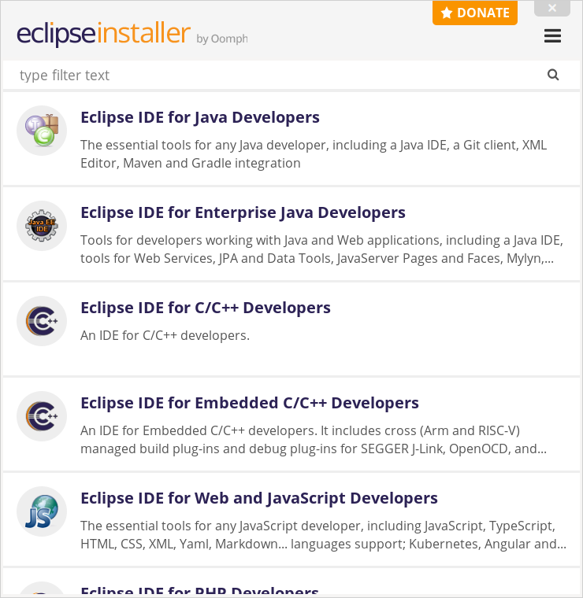
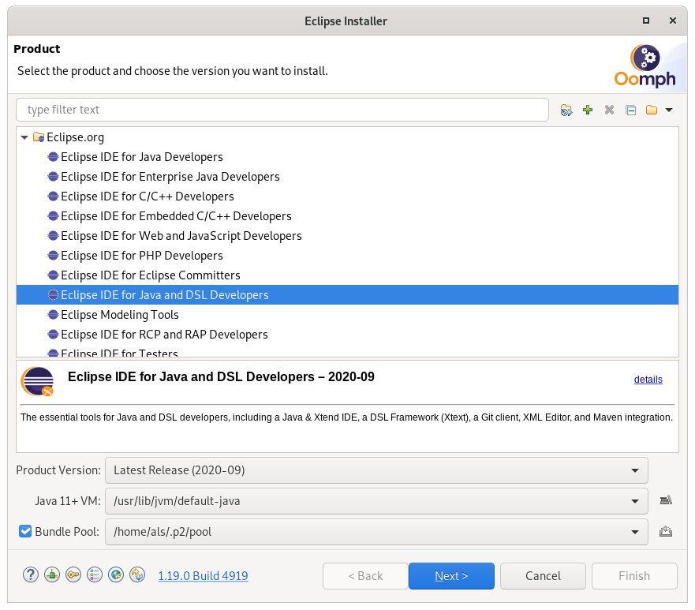
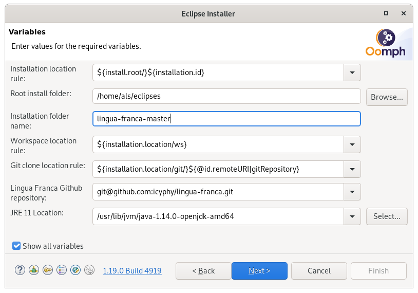

## Prerequisites

- Java 11 or up ([download from Oracle](https://www.oracle.com/java/technologies/javase-jdk11-downloads.html))
- Each target language may have additional requirements. The [latest release](Downloading-and-Building) will provide the best guide.

## Oomph Setup

The Eclipse setup with Oomph allows to automatically create a fully configured Eclipse IDE for the development of Lingua Franca. Note that we recommend installing a new instance of Eclipse even if you already have one for other purposes. There is no problem having multiple Eclipse installations on the same machine, and separate installations help prevent cross-project problems.

1. If you have previously installed Eclipse and you want to start fresh,  then remove or move a hidden directory called `.p2` in your home directory.  I do this:
```
mv ~/.p2 ~/.p2.bak
```

2. Go to the [Eclipse download site](https://www.eclipse.org/downloads/index.php) (https://www.eclipse.org/downloads/index.php) and download the Eclipse Installer for your platform. The site does not advertise that it ships the Oomph Eclipse Installer but downloading Eclipse with the orange download button will give you the installer.\
**You can skip this step if you already have the installer available on your system.**

3. Starting the installer for the first time will open a window that looks like the following (**if you have previously followed these steps, skip to step 4**):\


4. Click the Hamburger button at the top right corner and switch to "Advanced Mode".

5. Oomph now wants you to select the base Eclipse distribution for your development. We recommend to use "Eclipse IDE for Java and DSL Developers". As product version we recommend to use "Latest Release (...)". Since 2020-09, Eclipse requires Java 11+ to run.\
**IMPORTANT**: Xtext, used by the Lingua Franca code generator, does not yet support Java 15 or higher. Please use Java 11 through 14.\
Then press Next to continue with the project section.\


6. Next, we need to register the Lingua Franca specific setup in Oomph **(only the first time you use the installer)**. Click the green Plus button at the top right corner. Select "Github Projects" as catalog and paste the following URL into the "Resource URI" field:
`https://raw.githubusercontent.com/icyphy/lingua-franca/master/oomph/LinguaFranca.setup`.
Then press OK.
NOTE: to check out another branch instead, adjust the URL above accordingly. For instance, in order to install the setup from `foo-bar` branch, change the URL to `https://raw.githubusercontent.com/icyphy/lingua-franca/foo-bar/oomph/LinguaFranca.setup`. Also, in the subsequent screen in the wizard, select the particular branch of interest instead of default, which is `master`.

7. Now Oomph lists the Lingua Franca setup in the "<User>" directory of the "Github Projects" catalog. Check the Lingua Franca entry. A new entry for Lingua Franca will appear in the table at the bottom of the window. Select Lingua Franca and click Next.\


8. Now you can further configure where and how your development Eclipse should be created. Check "Show all variables" to enable all possible configuration options. You can hover over the field labels to get a more detailed explanation of their effects.
- If you already have cloned the LF repository and you want Eclipse to use this location instead of cloning it into the new IDE environment, you should adjust the "Git clone location rule".
- Preferably, you have a Github account with an SSH key uploaded to Github. Otherwise, you should adjust the "Lingua Franca Github repository" entry to use the https option in the pulldown menu.  See [adding an SSH key to your Github account](https://docs.github.com/en/github/authenticating-to-github/adding-a-new-ssh-key-to-your-github-account).
- If the "JRE 11 location" is empty, you need to install and/or locate a JDK that has at least version 11.


9. Click Next to get a summary of what will happen during installation. Click Finish to start.

10. Once the basic installation is complete, your new Eclipse will start. If it fails to clone the Github repository, then you should use the back button in the Oomph dialog and change the way you are accessing the repo (ssh or https). See above. \
The setup may also fail to clone the repository via SHH if Eclipse cannot find the private ssh key that matches the public key you uploaded to Github. You can configure the location of your private key in Eclipse as follows. In the Eclipse IDE, click the menu entry Window -> Preferences (on Mac Apple-Menu -> Preferences) and navigate to General -> Network Connections -> SSH2 in the tree view on the left and configure the SSH home directory and key names according to your computer. After the repo has been cloned, you can safely close the initial Oomph dialog (if not dismissed automatically). You will see a Welcome page that you can close. 

11. In the new Eclipse, it may automatically start building the project, or it may pop up an "Eclipse Updater" dialog. If neither happens, you can click the button with the yellow and blue cycling arrows in the status bar at the bottom. Oomph will perform various operations to configure the Eclipse environment, including the initial code generation for the LF language. This may take some time. Wait until the setup is finished.

12. If you get compile errors, make sure Eclipse is using Java 11. If you skipped the first step above (removing your `~/.p2` directory), then you may have legacy configuration information that causes Eclipse to mysteriously use an earlier version of Java. Lingua Franca requires Java 11 or higher, and will get compiler errors if it uses an earlier version. To fix this, go to the menu `Project->Properties` and select `Java Build Path`. Remove the entry for `JRE System Library [JRE for JavaSE-8]` (or similar). Choose `Add Library` on the right, and choose `JRE System Library`. You should now be able to choose `Workspace default JRE (JRE for JavaSE-11)`.  A resulting rebuild should then compile correctly.

13. When the setup dialog is closed, your LF development IDE is ready. Probably, Eclipse is still compiling some code but when this is finished as well, all error markers on the project should have disappeared. Now, you can start a runtime Eclipse to test the actual Lingua Franca end-user IDE. In the toolbar, click on the small arrow next to the green Start button. There may already be an entry named "Launch Runtime Eclipse", but probably not. To create it, click on "Run Configurations...". Expand the "Eclipse Application" entry, select "Launch Runtime Eclipse", as follows:


Make sure that the Execution Environment shows a version of Java that is at least Java 11. The click on "Run" at the bottom.

14. A new Eclipse starts where you can write LF programs and also get a diagram representation (but you fist need to open the diagram view by clicking on Window -> Show View -> Other and selecting Diagram in the "KIELER Lightweight Diagrams" folder). You  can close the welcome window in the new Eclipse and proceed to creating a new project, as below.

### Using the Lingua Franca IDE

Start the Lingua Franca IDE, create a project, and create your first LF program:
- Select File->New->Project  (a General Project is adequate).
- Give the project a name, like "test".
- You may want to uncheck `Use default location` and specify a location that you can remember.
- Close the Eclipse welcome window, if it is open. It obscures the project.
- Right click on the project name and select New->File.
- Give the new a name like "HelloWorld.lf" (with .lf extension).
- **IMPORTANT:** A dialog appears: Do you want to convert 'test' to an Xtext Project? Say YES.
- Start typing in Lingua-Franca! Try this:
```
  target C;
  main reactor HelloWorld {
      timer t;
      reaction(t) {=
          printf("Hello World.\n");
      =}
  }
```
When you save, generated code goes into your project directory, e.g. `/Users/yourname/test`.  That directory now has two directories inside it, `src-gen` and `bin`. The first contains the generated C code and the second contains the resulting executable program. Run the program:
```
    cd ~/lingua-franca-master/runtime-EclipseXtext/test
    bin/HelloWorld
```
The above directory assumes you chose default locations for everything. This should produce output that looks something like this:
```
---- Start execution at time Sun Mar 28 10:19:24 2021
---- plus 769212000 nanoseconds.
Hello World.
---- Elapsed logical time (in nsec): 0
---- Elapsed physical time (in nsec): 562,000
```
This should print "Hello World".

We strongly recommend browsing the system tests, which provide a concise overview of the capabilities of Lingua Franca. You can set up a project in the IDE for this using [these instructions](Regression-Tests#adding-and-editing-tests-in-eclipse).

## Working on the Lingua-Franca Compiler

The source code for the compiler is in the package `org.icyphy.linguafranca`.

- The grammar is in `src/org.icyphy/LinguaFranca.xtext`
- The code generator for the C target is in `src/org.icyphy.generator/CGenerator.xtend`
- The code generator for the TypeScript target is in `src/org.icyphy.generator/TypeScriptGenerator.xtend`
- The code generator for the C++ target is in `src/org.icyphy.generator/CppGenerator.xtend`
- The code generator for the Python target is in `src/org.icyphy.generator/PythonGenerator.xtend`

## Troubleshooting

- GitHub uses port `443` for its ssh connections. In some systems, the default expected port by `git` can be 22, causing a timeout when cloning the repo. This can be fixed by adding the following to `~/.ssh/config`:
    
    ```
    Host github.com
     Hostname ssh.github.com
     Port 443
    ```