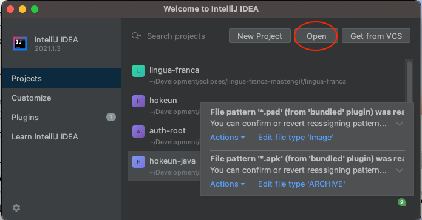
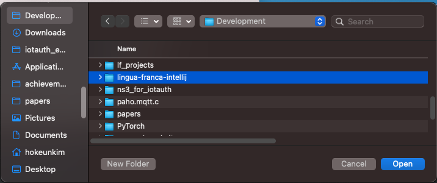
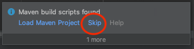
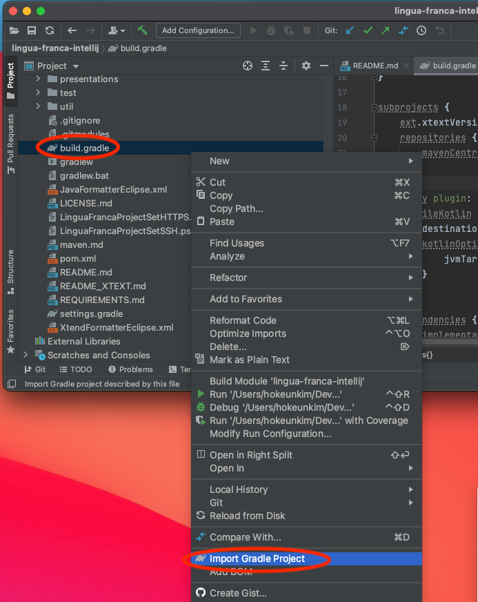
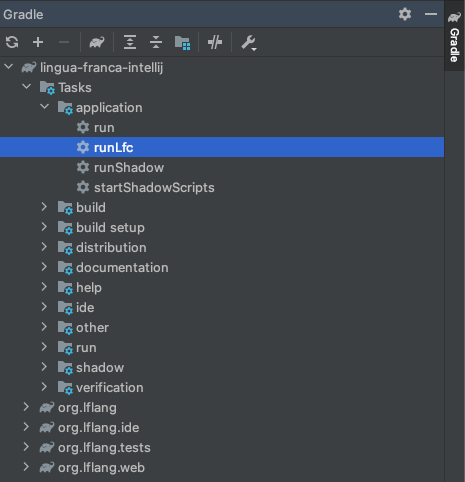
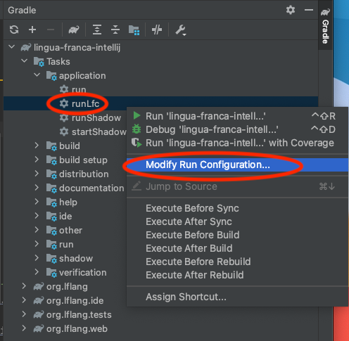
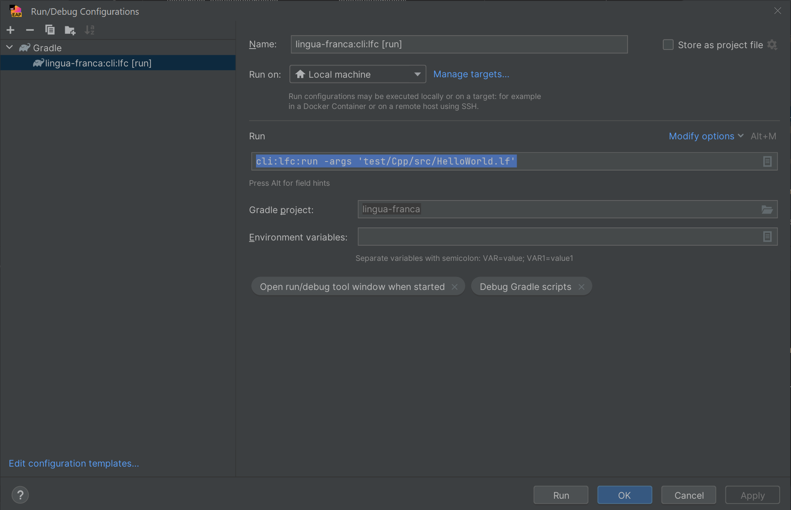

The IntelliJ environment allows running Kotlin-based code generators (e.g., Cpp code generator), which is currently impossible for the Eclipse environment.
IntelliJ also provides a debugger UI useful for debugging the code generation routines.

## IntelliJ Installation

Go to the [IntelliJ download page](https://www.jetbrains.com/idea/download/) and install IntelliJ for your operating system.
The community edition (CE) of IntelliJ should be enough as a development environment for Lingua Franca.

## Cloning lingua-franca repository

Clone the lingua-franca repository into your working directory.
For example, into a directory called `lingua-franca-intellij` using the following command:

```
$ git clone git@github.com:lf-lang/lingua-franca.git lingua-franca-intellij
```

## Opening lingua-franca as IntelliJ Project

Open IntelliJ IDE. At the startup screen, click Open.
Or, at the top menu bar, click File -> Open.



In the pop-up dialog, navigate to the cloned Git repository, and click Open.



If you see a pop-up saying "Maven build scripts found" after opening the repository as an IntelliJ project, click Skip since we want to use Gradle instead of Maven in this setup.



## Importing Gradle Project

The next step is to load the Gradle configs for building and running Lingua Franca tasks in IntelliJ.

You might see a pop-up asking if you want to load the project as Gradle.
If so, click Yes or OK.

However, in many cases, you may not see it.
You can import the Gradle project by navigating to the `build.gradle` file in the root directory of the lingua-franca repository.
Right-click `build.gradle`, then click `Import Gradle Project` in the drop-down list as shown below.



If you are prompted to a pop-up window asking if you trust the Gradle project, click Trust Project.


Once the repository is imported as a Gradle project, you will see a Gradle tab on the right.

You may see a message saying that Gradle project indexing is in progress at the bottom.
Indexing may take a few minutes.

Once the indexing finishes, you can expand the Gradle project and see the set of Tasks.



## Setting Up Run Configuration

You can set up a run configuration for running and debugging various Gradle tasks from the Gradle tab, including the code generation through LFC.
To set up a run configuration for runLfc task, right-click on `runLfc` under Gradle's Tasks -> application and click `Modify Run Configuration`. This will create a custom run/debug configuration for you.



In the Run/Debug Configurations dialog, click on the text box next to Tasks: and append args to specify the LF target. For example, `runLfc --args '../example/Cpp/src/CarBrake/CarBrake.lf'` Then click OK.



You will see a new run/debug config added to the top menu bar, as shown below.
You can always change the config, for example, changing the args, by clicking `Edit Configurations` via a drop-down menu.


## Running and Debugging

Using the newly added config, you can run and debug the code generator by clicking the play button and the bug button.


Set up breakpoints before starting the debugger by clicking the space right next to the line numbers.
While debugging, you can run code step-by-step by using the debugger tools.

