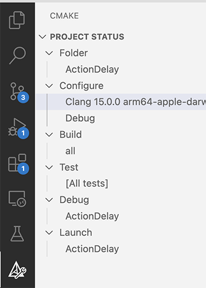

## Prerequisites

This page assumes you are using Visual Studio Code (VS Code).
Lingua Franca files are compiled using CMake, so you should install Microsoft's
[CMake Tools extension](https://marketplace.visualstudio.com/items?itemName=ms-vscode.cmake-tools).
The instructions here will work with the C, Cpp, and CCpp targets.
They may work with other targets as well, but will probably require additional VS Code extensions.

## Getting Started

When you run `lfc` to compile a Lingua Franca program, the generated code goes into a directory
called `src-gen` that will be created next to the `src` directory that contains your `.lf` files
(see [Structure of an LF project](<../writing-reactors/a-first-reactor.mdx#structure-of-an-lf-project>)).
You can directly edit, compile, run, and debug the generated code using VS Code.
To do this, start VS Code in the directory where the generated code is.
For example, if your program is `src/Foo.lf`, the following steps will get you into the generated code:

```
   lfc src/Foo.lf
   cd src-gen/Foo
   code .
```

The structure of the generated code depends on the target you are using, but in all cases, the project includes
everything needed to build and run the code.
You can use VS Code's convenient Search functionality to find your reaction bodies and set breakpoints.
You can also modify the code directly and recompile it using CMake, but be careful to save any changes that you
want to preserve somewhere else because the next time you run `lfc`, the `src-gen` directory will be overwritten.

## Running and Debugging Generated Code

First note that you have to ignore the built-in VS Code run and debug menu items, which are not designed to work with CMake.
That is, ignore the following menu items:


If you have installed the CMake Tools extension, then you should see its icon in the left sidebar,
as shown at the lower left here:



In the Configure menu, select the compiler to use.
Above the selection is Clang for an Apple silicon Mac.
Then, instead of using the menu items to build, run, and debug,
use the buttons at the _bottom_ of the screen, which look like this:


The Build button will compile the code.
To the right of that button are buttons for debugging and running the code.

## Debugging Federated Programs

For federated programs, the layout of the generated files is a bit different.
If, for example, your federated program is in `src/Foo.lf` and it has a top-level reactor named `bar`,
then you will find the generated code for the `bar` federate in `fed-gen/Foo/src-gen/federate__bar`.
You can then run and debug that individual federate from within VS Code, but you will also have
to manually run the RTI and the other federates in order for the code to start executing.

### Adding Arguments

To add arguments using VS code, you should add a directory `.vscode` right below the opened `src-gen` directory, and add a `settings.json` file such as below.
```
{
    "cmake.debugConfig": {
        "args": [
            "-i",
            "federation_id"
        ]
    }
}
```